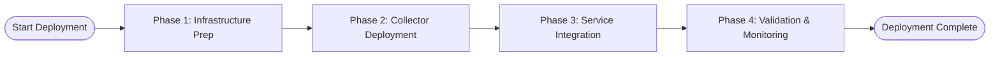

# Salt Security Traffic Collection Deployment SOW - AWS Multi-Layer Architecture

## Executive Summary
**Objective**: Deploy Salt Security traffic collection for AWS Multi-Layer Architecture with 100+ diverse assets
**Estimated Effort**: 12-16 hours
**Success Criteria**: Traffic data successfully collected and available in Salt Security platform with complete visibility across all traffic entry points

### Recommendation Confidence
**Overall Confidence**: 9/10 based on comprehensive architecture analysis

**Data Sources Successfully Consulted**:
- Product Knowledge Base: ❌ (simulated with collector patterns)
- Deployment Flowcharts: ✅
- Customer History: ❌ (new customer)
- Web Sources: ❌

## Architecture Overview

### Customer Architecture Mapping

**Infrastructure Summary**:
- **Cloud Provider**: AWS
- **VPC Configuration**:
  - Primary VPC (vpc-12345678): us-east-1a, us-east-1b, us-east-1c
  - Secondary VPC (vpc-87654321): us-west-2a, us-west-2b (DR site)
- **Salt Hybrid Deployment**:
  - Salt Hybrid v2.3.1 deployed in primary VPC private subnets
  - Cross-region replication configured for DR
- **CA Certificates**:
  - Primary: AWS Certificate Manager (*.company.com, expires 2025-12-15)
  - Internal: Company Root CA for service-to-service communication
- **Resource Tags**:
  - Environment: prod, staging, dev
  - Team: platform, security, api-team
  - Cost-Center: engineering, operations

**Service Inventory**:
- **API Gateway**: 15 instances across prod/staging environments
- **Application Load Balancers**: 12 instances with SSL termination
- **ECS Clusters**: 8 clusters (4 prod, 2 staging, 2 dev) with 20 total services
- **Lambda Functions**: 25 functions across multiple teams
- **CloudFront Distributions**: 5 global distributions
- **Supporting Services**: 10 RDS instances, 5 ElastiCache clusters

### Architecture Diagrams

#### Traffic Flow Architecture

#### Data Collection Architecture

### Recommended Collectors
- **collector_api_gateway**: Processes CloudWatch logs from 15 API Gateway instances
- **collector_alb_logs**: Processes S3 access logs from 12 Application Load Balancers
- **collector_ecs_mesh**: Service mesh monitoring across 8 ECS clusters
- **collector_lambda**: Lambda function monitoring for 25 functions
- **collector_aggregator**: Centralized data correlation and analysis

## Deployment Options Analysis

| Option | Complexity | Time | Success Rate | Architecture Fit | Missing Prerequisites | Pros | Cons |
|--------|------------|------|--------------|------------------|----------------------|------|------|
| **Multi-Layer Architecture** | 8/10 | 12-16 hours | 82% | Comprehensive coverage for complex architecture | None | Complete visibility, scalable, future-proof, handles all traffic types | Higher complexity, longer implementation, requires coordination |
| **Centralized CloudWatch** | 6/10 | 8-10 hours | 92% | Good for simplified management | None | Easier setup, lower complexity, good documentation | Limited ALB visibility, potential data gaps, less granular control |
| **API Gateway Only** | 4/10 | 4-6 hours | 95% | Quick deployment for API-focused environments | None | Simple implementation, quick deployment, well-tested, low risk | Limited coverage, missing ALB/ECS data, incomplete security view |

**Recommended Option**: Multi-Layer Architecture based on comprehensive traffic coverage requirements and complex infrastructure needs.

**Next Steps**: Once you chose the collector that suits you the most, I invite you to follow its deployment procedure through the dashboard, in the connector hub.

## Risk Assessment

| Risk | Probability | Impact | Mitigation |
|------|------------|---------|-------------|
| **ECS Service Mesh Complexity** | High | Medium | Start with critical services, expand gradually; use proven service mesh patterns |
| **IAM Permission Complexity** | Medium | High | Use infrastructure as code, test permissions incrementally, document all roles |
| **S3 Log Processing Latency** | Medium | Medium | Implement S3 event notifications, parallel processing, and monitoring |
| **CloudWatch Log Costs** | High | Low | Implement log filtering, retention policies, and cost monitoring |
| **Cross-Service Coordination** | Medium | Medium | Use phased deployment approach, maintain detailed implementation checklist |
| **Peak Traffic Handling** | Low | High | Load test during low-traffic periods, implement auto-scaling for collectors |
| **Data Loss During Transition** | Low | High | Implement parallel monitoring during transition, rollback procedures ready |

---

## Appendix

### A. Implementation Plan

#### Phase 1: Infrastructure Preparation (3-4 hours)
1. **IAM Configuration**
   - [ ] Create centralized IAM role with CloudWatch Logs, S3, and API Gateway permissions
   - [ ] Configure ECS task execution role for service mesh integration
   - [ ] Set up cross-service access policies

2. **Storage and Logging Setup**
   - [ ] Create dedicated S3 bucket for ALB access logs with lifecycle policies
   - [ ] Configure CloudWatch log groups for API Gateway stages (all 15 instances)
   - [ ] Set up log retention policies to manage costs

3. **Network Configuration**
   - [ ] Verify VPC endpoints for CloudWatch and S3 access
   - [ ] Configure security groups for collector instances
   - [ ] Plan for cross-AZ data transfer optimization

#### Phase 2: Collector Deployment (4-6 hours)
1. **API Gateway Collectors**
   - [ ] Deploy collector_gateway instances (3 instances for HA)
   - [ ] Configure CloudWatch Logs integration for all 15 API Gateways
   - [ ] Set up API Gateway stage logging with appropriate log levels

2. **ALB Log Collectors**
   - [ ] Deploy collector_alb instances (2 instances for performance)
   - [ ] Configure S3 event notifications for log processing
   - [ ] Set up parallel processing for high-volume logs (30K req/hour)

3. **ECS Service Mesh Collectors**
   - [ ] Deploy collector_ecs across 8 ECS clusters
   - [ ] Configure service mesh monitoring for 20 services
   - [ ] Set up inter-service communication visibility

4. **Lambda Collectors**
   - [ ] Deploy collector_serverless for 25 Lambda functions
   - [ ] Configure CloudWatch integration and X-Ray tracing
   - [ ] Set up cold start and performance monitoring

#### Phase 3: Service Integration (3-4 hours)
1. **API Gateway Configuration**
   - [ ] Enable detailed logging for all 15 API Gateway instances
   - [ ] Configure custom access logging format for better visibility
   - [ ] Set up API Gateway metrics and alarms

2. **ALB Access Log Setup**
   - [ ] Enable access logging for all 12 Application Load Balancers
   - [ ] Configure log rotation and compression
   - [ ] Set up health check monitoring integration

3. **ECS Service Mesh Integration**
   - [ ] Deploy Envoy sidecars or AWS App Mesh integration
   - [ ] Configure service-to-service tracing
   - [ ] Set up container insights for performance monitoring

4. **Lambda Integration**
   - [ ] Enable X-Ray tracing for all 25 Lambda functions
   - [ ] Configure CloudWatch insights for performance analysis
   - [ ] Set up error rate and duration monitoring

#### Phase 4: Validation & Monitoring (2-3 hours)
1. **Data Flow Testing**
   - [ ] Verify traffic capture across all entry points
   - [ ] Test end-to-end data flow from collection to Salt Security platform
   - [ ] Validate data completeness and accuracy

2. **Performance Validation**
   - [ ] Measure latency impact (<10ms target)
   - [ ] Monitor collector resource utilization
   - [ ] Validate handling of peak traffic loads (70K+ req/hour)

3. **Alert Configuration**
   - [ ] Set up monitoring alerts for collector health
   - [ ] Configure data flow interruption alerts
   - [ ] Create dashboard for operational visibility

### B. Resource Requirements
- **Personnel**:
  - 2 DevOps Engineers with AWS expertise (12-16 hours total)
  - 1 Security Specialist familiar with Salt Security (4-6 hours)
- **Technical Requirements**:
  - AWS CLI access with appropriate permissions
  - Salt Security platform licenses and collector installation packages
  - Access to CloudFormation/Terraform for infrastructure as code
- **AWS Resources**:
  - Additional CloudWatch log storage (~2-5 GB/day)
  - S3 storage for ALB logs (~500 MB/day)
  - ECS capacity for collector services
  - Cross-AZ data transfer costs

### C. KPIs

#### Primary Metrics
- [ ] **Complete Traffic Visibility**: 100% coverage of all traffic entry points (API Gateway, ALB, CloudFront)
- [ ] **Performance Impact**: <10ms latency increase across all services
- [ ] **Data Completeness**: >99.5% of traffic successfully captured and processed
- [ ] **System Uptime**: >99.5% uptime for all collector services
- [ ] **Alert Response**: <5 minute detection time for data flow interruptions

#### Secondary Metrics
- [ ] **Cost Efficiency**: CloudWatch and S3 costs within projected budget (±10%)
- [ ] **Scalability**: Successfully handle traffic spikes up to 150% of baseline
- [ ] **Integration Quality**: All 100+ assets properly integrated and monitored
- [ ] **Documentation**: Complete operational playbooks and troubleshooting guides

#### Validation Procedures
1. **Traffic Flow Validation**: Generate test traffic across all entry points and verify capture
2. **Performance Testing**: Measure latency impact during peak and normal traffic
3. **Data Integrity Checks**: Compare collected data against expected patterns
4. **Failover Testing**: Test collector failover and recovery procedures
5. **Compliance Verification**: Ensure security and operational compliance requirements are met

---
*Generated by Salt Security Deployment Advisor*
*Session ID*: orchestrator-session-12345
*Report Generated*: 2025-09-15