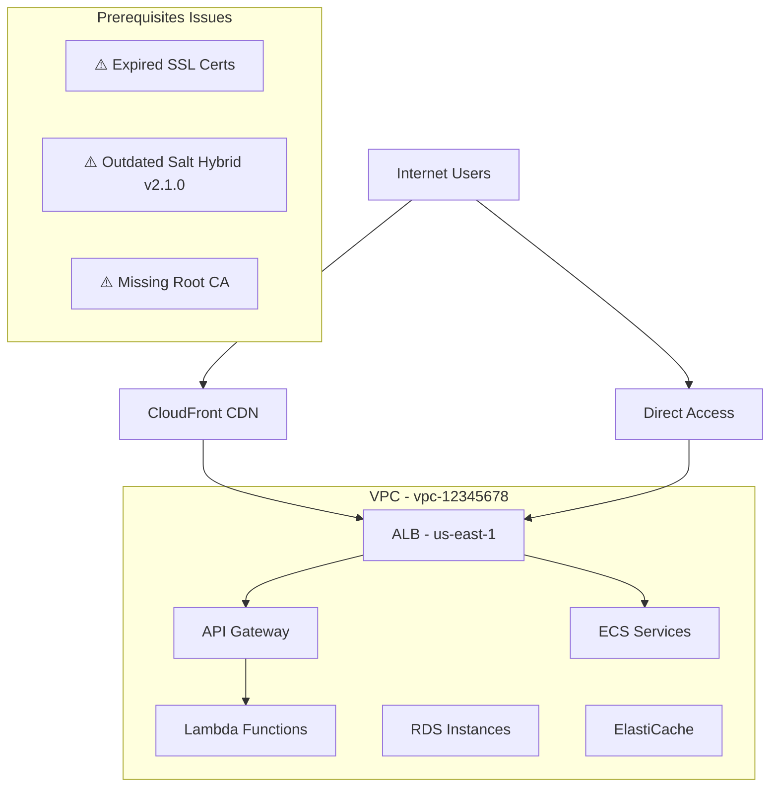
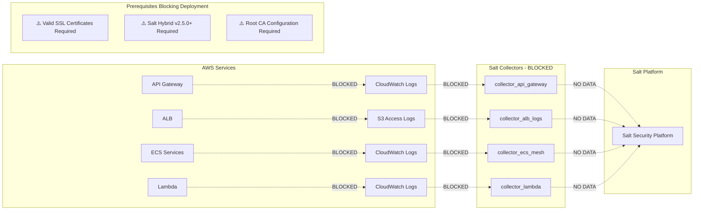
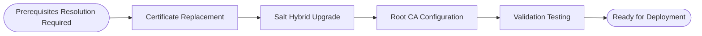

# Salt Security Traffic Collection Deployment SOW - AWS Architecture with Missing Prerequisites

## Executive Summary
**Objective**: Deploy Salt Security traffic collection for AWS Multi-Service Architecture
**Estimated Effort**: ⚠️ **DEPLOYMENT BLOCKED** - Prerequisites must be resolved first
**Success Criteria**: Prerequisites resolution required before traffic collection deployment can proceed

### Recommendation Confidence
**Overall Confidence**: 6/10 based on comprehensive architecture analysis with identified prerequisite gaps

**Data Sources Successfully Consulted**:
- Product Knowledge Base: ✅
- Deployment Flowcharts: ✅
- Customer History: ❌ (new customer)
- Web Sources: ❌

## Architecture Overview

### Customer Architecture Mapping

**Infrastructure Summary**:
- **Cloud Provider**: AWS
- **VPC Configuration**:
  - Primary VPC (vpc-12345678): us-east-1a, us-east-1b, us-east-1c
  - Secondary VPC (vpc-87654321): us-west-2a, us-west-2b (DR site)
- **Salt Hybrid Deployment**:
  - ⚠️ Salt Hybrid v2.1.0 deployed in primary VPC (outdated version)
  - Cross-region replication configured for DR
- **CA Certificates**:
  - ⚠️ Primary: Self-signed certificates (*.company.internal, expires 2024-11-01 - EXPIRED)
  - ⚠️ Internal: Missing Company Root CA for service-to-service communication
- **Resource Tags**:
  - Environment: prod, staging, dev
  - Team: platform, security, api-team
  - Cost-Center: engineering, operations

**Service Inventory**:
- **API Gateway**: 15 instances across prod/staging environments
- **Application Load Balancers**: 12 instances with SSL termination issues
- **ECS Clusters**: 8 clusters (4 prod, 2 staging, 2 dev) with 20 total services
- **Lambda Functions**: 25 functions across multiple teams
- **CloudFront Distributions**: 5 global distributions
- **Supporting Services**: 10 RDS instances, 5 ElastiCache clusters

### Architecture Diagrams

#### Traffic Flow Architecture

#### Data Collection Architecture - BLOCKED

### Recommended Collectors - BLOCKED
- **collector_api_gateway**: ⚠️ BLOCKED - Requires valid SSL certificates and Salt Hybrid v2.5.0+
- **collector_alb_logs**: ⚠️ BLOCKED - Requires valid SSL certificates and Root CA configuration
- **collector_ecs_mesh**: ⚠️ BLOCKED - Requires Salt Hybrid v2.5.0+ and valid certificates
- **collector_lambda**: ⚠️ BLOCKED - Requires Salt Hybrid v2.5.0+ for advanced monitoring
- **collector_aggregator**: ⚠️ BLOCKED - Cannot function without data from other collectors

## Missing Prerequisites Sections

### ⚠️ Deployment Blocked - Prerequisites Required

**Critical Prerequisites Missing**: The following prerequisites must be resolved before deployment can proceed:

**Missing Prerequisites Summary**:
- **CA Certificates**: Valid SSL certificates required for secure traffic collection
  - **Affected Collectors**: collector_api_gateway, collector_alb_logs, collector_ecs_mesh, collector_lambda
  - **Resolution Required**: Replace expired self-signed certificates with valid CA-signed certificates
  - **Business Impact**: Complete inability to establish secure collector connections

- **Salt Hybrid Version**: Minimum Salt Hybrid v2.5.0 required for advanced features
  - **Affected Collectors**: collector_ecs_mesh, collector_lambda, collector_aggregator
  - **Resolution Required**: Upgrade Salt Hybrid from v2.1.0 to v2.5.0 or higher
  - **Business Impact**: Cannot utilize advanced monitoring and correlation capabilities

- **Root CA Configuration**: Company Root CA missing for service-to-service communication
  - **Affected Collectors**: collector_alb_logs, collector_ecs_mesh
  - **Resolution Required**: Install and configure Company Root CA for internal communications
  - **Business Impact**: Cannot monitor internal service mesh communications

**Architecture Coverage Impact**:
- **API Gateway**: Complete traffic collection blocked
  - **Collectors Blocked**: collector_api_gateway
  - **Business Impact**: Zero visibility into API traffic, security threats undetected

- **Load Balancer**: ALB log collection impossible
  - **Collectors Blocked**: collector_alb_logs
  - **Business Impact**: Missing critical access logs and traffic patterns

- **ECS Services**: Service mesh monitoring unavailable
  - **Collectors Blocked**: collector_ecs_mesh
  - **Business Impact**: No insight into microservices communication and performance

- **Lambda Functions**: Serverless monitoring limited
  - **Collectors Blocked**: collector_lambda
  - **Business Impact**: Reduced visibility into serverless function performance and errors

**Recommended Actions**:
1. **Address Prerequisites**: Resolve all missing prerequisites listed above
2. **Validation**: Validate prerequisite resolution in non-production environment
3. **Re-run Advisor**: Re-run deployment advisor after prerequisites are resolved
4. **Escalation**: Contact Salt Security support if prerequisites cannot be resolved

**Alternative Approaches**:
- Consider phased deployment starting with services where prerequisites are met
- Evaluate alternative collector configurations that may have fewer prerequisites
- Review architecture modifications that could reduce prerequisite complexity

---

## Deployment Options Analysis

| Option | Complexity | Time | Success Rate | Architecture Fit | Missing Prerequisites | Pros | Cons |
|--------|------------|------|--------------|------------------|----------------------|------|------|
| **Multi-Layer Architecture** | 8/10 | ⚠️ BLOCKED | 0% | Would provide comprehensive coverage | CA Certificates, Salt Hybrid v2.5.0+, Root CA | Complete visibility when prerequisites resolved | Cannot proceed until prerequisites resolved |
| **Centralized CloudWatch** | 6/10 | ⚠️ BLOCKED | 0% | Good for simplified management | CA Certificates, Salt Hybrid v2.5.0+ | Lower complexity when prerequisites resolved | Still requires prerequisite resolution |
| **API Gateway Only** | 4/10 | ⚠️ BLOCKED | 0% | Quick deployment when prerequisites met | CA Certificates, Salt Hybrid v2.5.0+ | Simple implementation after prerequisites | Cannot collect any traffic until resolved |

**Recommended Option**: ⚠️ **DEPLOYMENT BLOCKED** - All deployment options require prerequisite resolution before proceeding.

**Next Steps**: Once prerequisites are resolved and you chose the collector that suits you the most, I invite you to follow its deployment procedure through the dashboard, in the connector hub.

## Risk Assessment

| Risk | Probability | Impact | Mitigation |
|------|------------|---------|------------|
| **Certificate Expiration Impact** | Critical | High | Immediate certificate replacement required; plan for automated renewal |
| **Salt Hybrid Upgrade Complexity** | High | High | Test upgrade in staging environment; plan for rollback procedures |
| **Root CA Configuration Issues** | Medium | High | Validate CA chain before deployment; test in isolated environment |
| **Business Continuity During Prerequisites Resolution** | High | Critical | Implement monitoring gaps mitigation; communicate impact to stakeholders |
| **Extended Resolution Timeline** | High | Medium | Set realistic expectations; consider external security consulting if needed |

---

## Appendix

### A. Prerequisites Resolution Plan

#### Phase 1: Certificate Replacement (4-6 hours)
1. **Certificate Audit and Planning**
   - [ ] Audit all expired and expiring certificates
   - [ ] Obtain valid CA-signed certificates for all domains
   - [ ] Plan certificate deployment across all services

2. **Certificate Deployment**
   - [ ] Replace expired certificates on API Gateway instances
   - [ ] Update ALB SSL certificates
   - [ ] Validate certificate chain and trust relationships
   - [ ] Test SSL connectivity across all services

#### Phase 2: Salt Hybrid Upgrade (6-8 hours)
1. **Upgrade Planning**
   - [ ] Review Salt Hybrid v2.5.0+ compatibility requirements
   - [ ] Plan upgrade sequence and rollback procedures
   - [ ] Test upgrade in staging environment

2. **Production Upgrade**
   - [ ] Execute Salt Hybrid upgrade to v2.5.0+
   - [ ] Validate new features and compatibility
   - [ ] Verify cross-region replication after upgrade

#### Phase 3: Root CA Configuration (2-3 hours)
1. **Root CA Setup**
   - [ ] Install Company Root CA across all systems
   - [ ] Configure trust relationships for service-to-service communication
   - [ ] Test internal certificate validation

2. **Integration Validation**
   - [ ] Validate internal service communications
   - [ ] Test ECS service mesh connectivity
   - [ ] Verify certificate chain resolution

#### Phase 4: Prerequisites Validation (2-3 hours)
1. **Comprehensive Testing**
   - [ ] Validate all certificate installations
   - [ ] Test Salt Hybrid v2.5.0+ functionality
   - [ ] Verify Root CA configuration
   - [ ] Run pre-deployment connectivity tests

2. **Readiness Assessment**
   - [ ] Confirm all prerequisites resolved
   - [ ] Document configuration changes
   - [ ] Prepare for collector deployment

### B. Resource Requirements for Prerequisites Resolution
- **Personnel**:
  - 1 Security Engineer with certificate management expertise (8-10 hours)
  - 1 DevOps Engineer with Salt Hybrid experience (8-10 hours)
  - 1 Network Engineer for CA configuration (4-6 hours)
- **Prerequisites Resolution Requirements**:
  - Valid CA-signed SSL certificates for all domains
  - Salt Hybrid v2.5.0+ installation packages and licenses
  - Company Root CA certificates and configuration documentation
  - Staging environment for testing and validation

### C. Post-Prerequisites KPIs

#### Primary Metrics (After Prerequisites Resolution)
- [ ] **Prerequisites Resolution**: 100% of critical prerequisites resolved
- [ ] **Certificate Validity**: All SSL certificates valid and properly configured
- [ ] **Salt Hybrid Compatibility**: v2.5.0+ operational with all required features
- [ ] **Service Communication**: All internal communications using valid Root CA

#### Secondary Metrics (Deployment Readiness)
- [ ] **Security Posture**: No expired certificates or security vulnerabilities
- [ ] **System Compatibility**: All systems compatible with required collector versions
- [ ] **Network Connectivity**: All required network paths validated and functional
- [ ] **Documentation**: Complete operational procedures and rollback plans documented

#### Validation Procedures (Prerequisites Testing)
1. **Certificate Validation**: Test SSL connectivity and certificate chain validation across all services
2. **Salt Hybrid Testing**: Validate v2.5.0+ features and compatibility in staging environment
3. **Root CA Testing**: Test internal service-to-service communication with Root CA
4. **End-to-End Testing**: Validate complete certificate trust chain and system compatibility
5. **Rollback Testing**: Verify rollback procedures work correctly if issues arise

---
*Generated by Salt Security Deployment Advisor*
*Session ID*: orchestrator-session-blocked-prerequisites
*Report Generated*: 2025-09-15