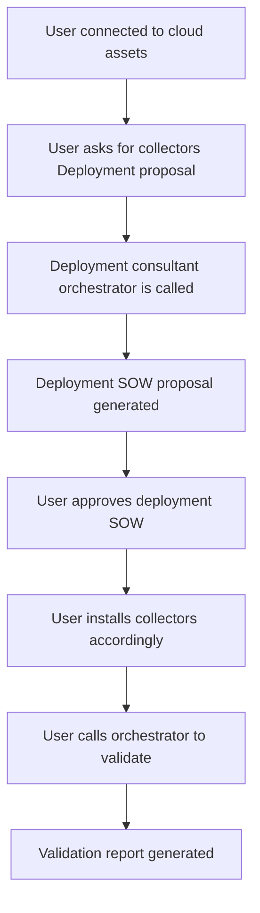

# Main Deployment Flow

```mermaid
flowchart TD
    A["User connected to cloud assets"] --> B["User asks for collectors Deployment proposal"]
    B --> C["Deployment consultant orchestrator is called"]
    C --> D["Deployment SOW proposal generated"]
    D --> E["User approves deployment SOW"]
    E --> F["User installs collectors accordingly"]
    F --> G["User calls orchestrator to validate"]
    G --> H["Validation report generated"]
```