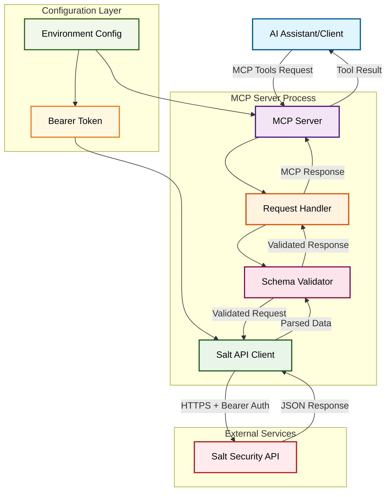

# System Architecture

## Overview
The Salt API MCP Server is a lightweight TypeScript application that acts as a secure bridge between AI assistants and Salt Security's Cloud Assets API. It implements the Model Context Protocol (MCP) specification to provide standardized access to cloud asset data.

## Mermaid Architecture Diagram



## Component Architecture

### 1. MCP Server Core (`src/index.ts`)
- **Purpose**: Main entry point implementing MCP protocol specification
- **Responsibilities**:
  - Tool registration and discovery
  - Request routing and response handling
  - Error boundary and exception handling
  - Transport layer management (stdio)
- **Key Features**:
  - Implements `list_cloud_assets` and `get_cloud_asset` tools
  - Schema-based input validation
  - Standardized error responses

### 2. Salt API Client (`src/salt-api-client.ts`)
- **Purpose**: Abstraction layer for Salt Security API integration
- **Responsibilities**:
  - HTTP client configuration and management
  - Authentication token injection
  - Request/response transformation
  - API-specific error handling
- **Key Features**:
  - Axios-based HTTP client with interceptors
  - Bearer token authentication from environment
  - Response schema validation with Zod
  - Comprehensive error mapping

### 3. Request Flow Architecture

#### Input Validation Layer
- **Tool Schema Validation**: Zod schemas validate MCP tool arguments
- **API Schema Validation**: Response schemas ensure data integrity
- **Error Propagation**: Validation errors bubble up with context

#### Authentication Layer
- **Environment-based Config**: Bearer token loaded from `.env`
- **Request Interception**: Axios interceptors inject authentication headers
- **Security**: Token never exposed in logs or error messages

#### Response Processing Layer
- **Data Transformation**: Raw API responses parsed and validated
- **Error Standardization**: API errors mapped to user-friendly messages
- **Type Safety**: Full TypeScript coverage for request/response types

## Data Flow

### 1. List Cloud Assets Flow
```
AI Request → MCP Server → Validate Args → Salt Client → HTTPS Request
                                                              ↓
AI Response ← JSON Format ← Validate Schema ← Parse Response ← API Response
```

### 2. Get Cloud Asset Flow
```
AI Request → MCP Server → Validate ID → Salt Client → HTTPS Request (/cloud-assets/asset/{id})
                                                             ↓
AI Response ← JSON Format ← Validate Schema ← Parse Response ← API Response
```

## Security Architecture

### 1. Authentication Security
- **Bearer Token Storage**: Environment variable isolation
- **Token Transmission**: HTTPS-only communication
- **No Token Logging**: Authentication headers excluded from logs
- **Error Sanitization**: Authentication errors don't expose token details

### 2. Input Validation Security
- **Schema Enforcement**: All inputs validated against strict schemas
- **Parameter Sanitization**: URL encoding for path parameters
- **Bounds Checking**: Limit and offset parameters validated for safety
- **Type Safety**: Runtime validation matches compile-time types

### 3. Network Security
- **HTTPS Enforcement**: All API communication over TLS
- **Timeout Configuration**: 30-second request timeout prevents hanging
- **Error Boundary**: Network errors handled gracefully
- **Base URL Validation**: Hardcoded API endpoint prevents injection

## Configuration Management

### Environment Variables
- `SALT_BEARER_TOKEN`: Required Bearer token for API authentication
- Configuration validation on startup
- Graceful error handling for missing configuration

### Runtime Configuration
- HTTP client timeout: 30 seconds
- Default pagination: limit=100, offset=0
- Maximum limit: 1000 assets per request
- Base API URL: https://api.secured-api.com/v1

## Error Handling Strategy

### 1. Client-Side Errors
- **401 Unauthorized**: Bearer token invalid or expired
- **403 Forbidden**: Insufficient API permissions
- **404 Not Found**: Asset ID doesn't exist
- **429 Rate Limited**: API quota exceeded

### 2. Server-Side Errors
- **Network Timeout**: Connection timeout handling
- **Invalid Response**: Schema validation failures
- **Unexpected Errors**: Generic error boundary

### 3. MCP Protocol Errors
- **Tool Not Found**: Unknown tool name handling
- **Invalid Arguments**: Schema validation error responses
- **System Errors**: Internal server error propagation

## Performance Considerations

### 1. Request Optimization
- **Connection Reuse**: Axios client instance reuse
- **Request Pooling**: HTTP connection pooling enabled
- **Timeout Management**: Prevents resource leaks

### 2. Memory Management
- **Response Streaming**: Large responses handled efficiently
- **Schema Validation**: Minimal overhead validation
- **Error Object Cleanup**: Proper error handling prevents memory leaks

## Deployment Architecture

### Development Environment
- **TypeScript Compilation**: Source-to-build pipeline
- **Hot Reload**: tsx for development server
- **Environment Isolation**: .env file configuration

### Production Environment
- **Compiled JavaScript**: TypeScript compiled to ES2022
- **Process Management**: Single-process MCP server
- **Logging**: stderr logging for operational visibility

## Scalability Design

### Current Limitations
- **Single Process**: No horizontal scaling capability
- **Memory Bound**: Limited by Node.js memory constraints
- **API Rate Limits**: Bound by Salt Security API quotas

### Future Scalability Options
- **Process Pooling**: Multiple MCP server instances
- **Connection Pooling**: Enhanced HTTP client configuration
- **Caching Layer**: Response caching for frequently accessed assets
- **Health Monitoring**: API connectivity and performance monitoring