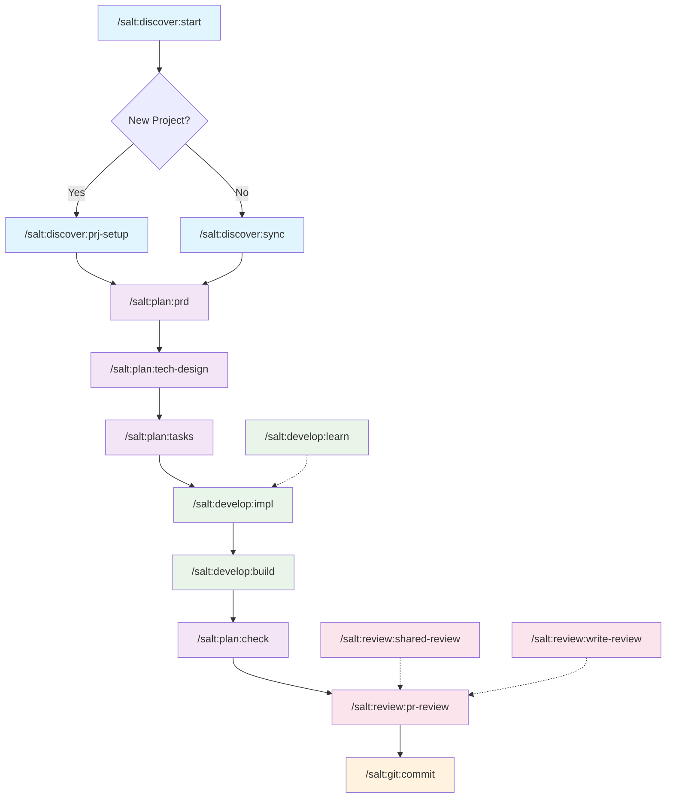

# Salt Claude Commands Guide

A comprehensive guide to AI-driven development using Salt Claude commands for systematic, efficient, and maintainable software development.

## Command Categories

### Discovery Phase
1. **`/salt:discover:start`** - Start new coding session and understand current project state
2. **`/salt:discover:prj-setup`** - Initialize repository structure and perform comprehensive analysis  
3. **`/salt:discover:sync`** - Synchronize documentation with current implementation

### Planning Phase
4. **`/salt:plan:prd`** - Generate Product Requirements Document (business requirements)
5. **`/salt:plan:tech-design`** - Create Technical Design Document (implementation approach)
6. **`/salt:plan:tasks`** - Generate detailed task list from PRD and tech design
7. **`/salt:plan:check`** - Verify task completion status against actual code

### Development Phase
8. **`/salt:develop:impl`** - Implement tasks with strict completion protocol
9. **`/salt:develop:learn`** - Guide junior developers through implementation
10. **`/salt:develop:build`** - Build and test the project
11. **`/salt:develop:sc`** - Review screenshots for UI verification

### Version Control
12. **`/salt:git:commit`** - Commit changes with descriptive messages

### Review Phase
13. **`/salt:review:pr-review`** - Conduct code reviews with detailed feedback
14. **`/salt:review:shared-review`** - Help reviewers understand project structure and components
15. **`/salt:review:write-review`** - Generate detailed code structure reviews for understanding

## Recommended Usage Order

## Development Workflow

1. **Start Session**: `/salt:discover:start`
2. **Initialize/Sync**: `/salt:discover:prj-setup` (first time) or `/salt:discover:sync` (existing projects)
3. **Plan Feature**: `/salt:plan:prd` → `/salt:plan:tech-design` → `/salt:plan:tasks`
4. **Develop**: `/salt:develop:impl` (with `/salt:develop:learn` for guidance) → `/salt:develop:build`
5. **Review**: `/salt:plan:check` → `/salt:review:pr-review` → `/salt:review:shared-review` or `/salt:review:write-review`
6. **Version Control**: `/salt:git:commit`

This workflow follows KISS principles, Clean Architecture, and emphasizes TDD with progressive task completion.