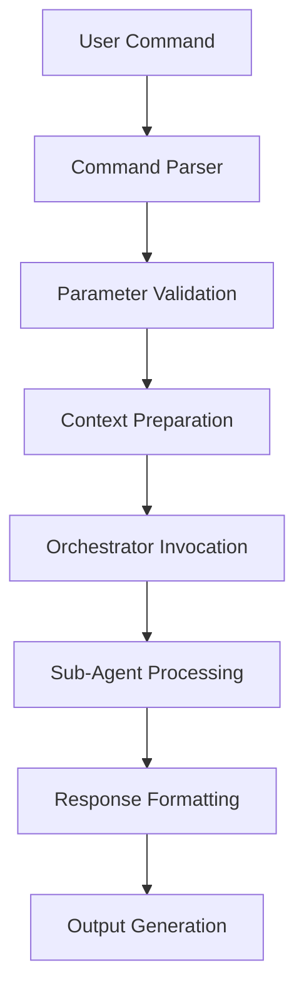

# Advisor Command Integration

## Overview
This directory contains specifications for the `/advisor:` command family that provides structured workflows for Salt Security deployment assistance through Claude Code CLI integration.

## Command Family

### Available Commands
- **[/advisor:advise](advisor-advise.md)** - Deployment guidance workflow with natural language query processing
- **[/advisor:troubleshoot](advisor-troubleshoot.md)** - Error analysis and resolution guidance with architecture-aware solutions
- **[/advisor:validate](advisor-validate.md)** - Deployment status verification with SOW comparison and gap analysis

## Command Architecture

### Common Design Principles
All advisor commands follow a consistent three-phase processing workflow:

1. **Command Parsing and Validation**
   - Parse natural language queries and optional parameters
   - Validate parameter values and set defaults
   - Extract implicit entities (cloud providers, services, etc.)

2. **Orchestrator Integration**
   - Map command parameters to orchestrator context
   - Invoke orchestrator agent via Task tool
   - Route requests to appropriate specialized sub-agents

3. **Response Processing and Formatting**
   - Parse sub-agent responses using standardized YAML schema
   - Format output according to command-specific templates
   - Handle error scenarios with graceful degradation

### Parameter Standardization
```yaml
common_parameters:
  cloud_provider: "aws" | "azure" | "gcp"
    description: "Specify cloud provider for targeted recommendations"

  detail_level: "quick" | "standard" | "comprehensive"
    description: "Control amount of detail in responses"

  expertise_level: "beginner" | "intermediate" | "expert"
    description: "Tailor guidance to user expertise level"

  format: "markdown" | "json" | "pdf"
    description: "Output format for generated content"

  output_file: string
    description: "Specify output file path for saving results"
```

## Integration with Orchestrator System

### Request Flow


### Orchestrator Coordination
Each command integrates with the orchestrator agent by:

1. **Context Mapping**: Converting command parameters to orchestrator conversation context
2. **Workflow Specification**: Indicating which sub-agents should be invoked
3. **Quality Assurance**: Validating completeness and accuracy of responses
4. **Error Handling**: Managing failures and implementing graceful degradation

## Command Specifications

### /advisor:advise - Deployment Guidance
**Purpose**: Provide expert deployment recommendations through flowchart consultation and architecture analysis

**Workflow**: User Query → Deployment Advisor → Flowchart Consultation → Architecture Analysis → Recommendation Generation

**Key Features**:
- Natural language deployment question processing
- Cloud-specific flowchart consultation
- Architecture-aware recommendations
- Multi-option deployment analysis with trade-offs

### /advisor:troubleshoot - Error Resolution
**Purpose**: Analyze deployment errors and provide step-by-step resolution guidance

**Workflow**: Error Description → Error Handler → Pattern Matching → Solution Recommendation → Diagnostic Procedures

**Key Features**:
- Error pattern recognition and classification
- Architecture-specific troubleshooting
- Step-by-step resolution procedures
- Escalation criteria and support handoff

### /advisor:validate - Deployment Verification
**Purpose**: Verify deployment completeness against SOW requirements and best practices

**Workflow**: Validation Request → Validator → SOW Comparison → Gap Analysis → Remediation Planning

**Key Features**:
- SOW compliance validation
- Infrastructure and connectivity testing
- Gap analysis with remediation plans
- Comprehensive validation reporting

### /advisor:report - Documentation Generation
**Purpose**: Generate deployment SOWs, session summaries, and implementation documentation

**Workflow**: Report Request → Reporter → Template Selection → Content Generation → Document Formatting

**Key Features**:
- Comprehensive SOW generation with Mermaid diagrams
- Session documentation and learning capture
- Multiple output formats and templates
- Executive and technical audience customization

## Error Handling Strategy

### Common Error Scenarios
```yaml
error_handling:
  command_parsing_errors:
    - invalid_parameters: "Parameter validation failures"
    - missing_required_data: "Insufficient context for processing"
    - malformed_queries: "Unparseable natural language input"

  orchestrator_integration_errors:
    - sub_agent_failures: "Sub-agent processing failures"
    - timeout_errors: "Processing timeout scenarios"
    - partial_responses: "Incomplete sub-agent responses"

  output_generation_errors:
    - format_conversion_failures: "Output format conversion issues"
    - file_system_errors: "File writing and path issues"
    - template_processing_errors: "Template rendering failures"
```

### Graceful Degradation
All commands implement graceful degradation strategies:

1. **Partial Success Handling**: Provide best-effort results when some data is unavailable
2. **Fallback Recommendations**: Use cached or general guidance when specific recommendations fail
3. **Clear Error Communication**: Explain limitations and suggest alternative approaches
4. **Retry Guidance**: Provide clear instructions for retrying with different parameters

## Performance Optimization

### Response Time Targets
```yaml
performance_targets:
  advisor_advise: "< 30 seconds (standard), < 45 seconds (comprehensive)"
  advisor_troubleshoot: "< 20 seconds (standard), < 35 seconds (verbose)"
  advisor_validate: "< 45 seconds (standard), < 90 seconds (comprehensive)"
  advisor_report: "< 30 seconds (standard), < 60 seconds (comprehensive)"
```

### Optimization Strategies
- **Parallel Processing**: Invoke multiple sub-agents concurrently where possible
- **Intelligent Caching**: Cache common queries and architecture patterns
- **Progressive Enhancement**: Provide quick initial responses, then add details
- **Background Processing**: Generate complex reports in background when possible

## Usage Patterns

### Basic Usage
```bash
# Quick deployment recommendation
/advisor:advise "What collector for AWS API Gateway?"

# Troubleshoot specific error
/advisor:troubleshoot "Getting 403 permission errors"

# Validate deployment
/advisor:validate "deployment completeness"

# Generate SOW
/advisor:report "deployment SOW"
```

### Advanced Usage
```bash
# Comprehensive AWS-specific guidance
/advisor:advise "Production deployment strategy" \
  --cloud-provider aws \
  --expertise-level intermediate \
  --detail-level comprehensive

# Detailed troubleshooting with diagnostics
/advisor:troubleshoot "Network connectivity issues" \
  --cloud-provider azure \
  --verbose \
  --include-diagnostics

# SOW compliance validation with report
/advisor:validate --sow-document ./sow.md \
  --validation-depth comprehensive \
  --export-report

# Executive SOW with custom template
/advisor:report "deployment SOW" \
  --template enterprise \
  --export-format executive \
  --output-file ./executive-sow.pdf
```

## Integration Testing

### Command Validation
Each command specification includes:
- **Parameter validation tests**: Verify all parameter combinations work correctly
- **Integration tests**: Ensure orchestrator coordination functions properly
- **Output format tests**: Validate all output formats generate correctly
- **Error handling tests**: Verify graceful degradation in failure scenarios

### End-to-End Testing
- **Workflow testing**: Complete user journey from command to output
- **Performance testing**: Verify response time targets are met
- **Quality testing**: Ensure output quality and completeness
- **User experience testing**: Validate commands meet user expectations

## Future Enhancements

### Planned Command Extensions
- **Interactive mode**: Multi-turn conversations within single commands
- **Batch processing**: Process multiple queries or validations simultaneously
- **Scheduling**: Schedule regular validation or reporting tasks
- **Notification integration**: Send results to external systems

### Advanced Features
- **Machine learning integration**: Learn from usage patterns to improve recommendations
- **Custom templates**: User-defined templates for reports and documentation
- **API integration**: Direct integration with external monitoring and deployment systems
- **Collaboration features**: Share and collaborate on deployment plans and reports