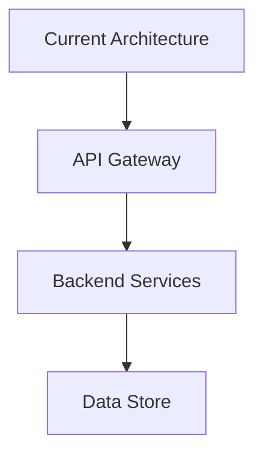
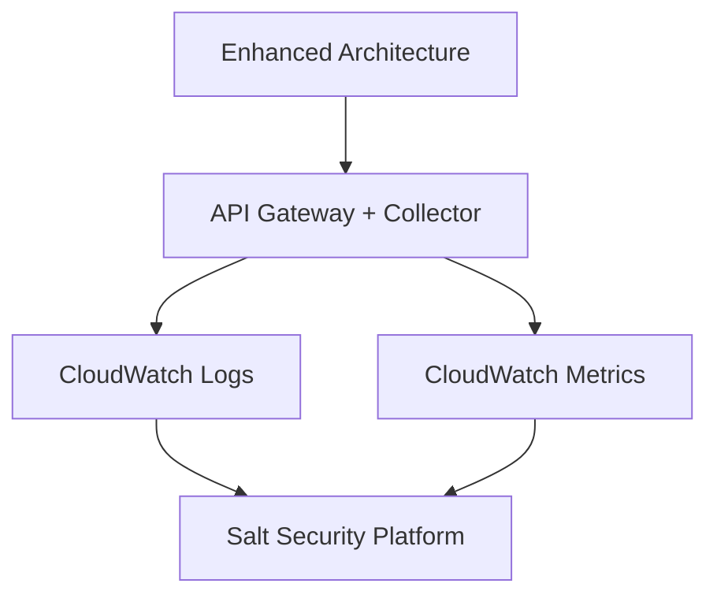

# /advisor:report Command Specification

## Overview
The `/advisor:report` command provides structured SOW generation and session documentation workflow, routing reporting requests through the reporter agent for comprehensive deployment documentation with Mermaid diagrams and session storage management.

## Command Syntax
```bash
/advisor:report [report_type] [--options]
```

## Parameters

### Required Parameters
- **report_type**: Type of report to generate (optional - defaults to deployment SOW)
  - Example: "deployment SOW"
  - Example: "session summary"
  - Example: "validation report"
  - Example: "implementation guide"

### Optional Parameters
```yaml
optional_flags:
  --format: "markdown" | "json" | "pdf"
    description: "Output format for the generated report"
    default: "markdown"
    example: "/advisor:report --format markdown"

  --detail-level: "summary" | "standard" | "comprehensive"
    description: "Level of detail to include in report"
    default: "standard"
    example: "/advisor:report --detail-level comprehensive"

  --include-diagrams: boolean
    description: "Include Mermaid architecture and flow diagrams"
    default: true
    example: "/advisor:report --include-diagrams"

  --output-file: string
    description: "Specify output file path for the report"
    example: "/advisor:report --output-file ./deployment-sow.md"

  --template: string
    description: "Specify custom template to use"
    options: ["aws", "azure", "gcp", "multi-cloud", "enterprise"]
    example: "/advisor:report --template aws"

  --include-session-data: boolean
    description: "Include session conversation and decision history"
    default: false
    example: "/advisor:report --include-session-data"

  --anonymize: boolean
    description: "Anonymize customer-specific information"
    default: false
    example: "/advisor:report --anonymize"

  --export-format: "document" | "presentation" | "executive"
    description: "Optimize format for specific audience"
    default: "document"
    example: "/advisor:report --export-format executive"
```

## Command Processing Workflow

### Phase 1: Report Specification Analysis
```yaml
report_processing:
  report_type_analysis:
    - identify_report_purpose: "Understand what report is needed"
    - determine_audience: "Identify target audience (technical, executive, etc.)"
    - assess_required_content: "Determine what content needs to be included"
    - evaluate_data_requirements: "Identify what data is needed"

  context_gathering:
    - collect_deployment_data: "Gather all deployment-related information"
    - extract_session_history: "Pull relevant session conversation data"
    - gather_validation_results: "Include any validation outcomes"
    - collect_architecture_data: "Include infrastructure and architecture details"
```

### Phase 2: Orchestrator Integration
```yaml
orchestrator_handoff:
  context_preparation:
    conversation_context:
      command_invoked: "/advisor:report"
      report_type: specified_or_inferred_type
      format_preference: from_format_parameter
      detail_preference: from_detail_level_parameter

    reporting_context:
      data_inputs:
        deployment_recommendation: from_session_context
        validation_results: if_available
        error_resolution_history: if_any
        conversation_transcript: if_include_session_data

      output_preferences:
        format: from_parameter_or_default
        detail_level: from_parameter_or_default
        include_diagrams: from_parameter_or_default
        anonymize_data: from_parameter

  orchestrator_invocation:
    tool_call: "Task"
    subagent_type: "general-purpose"
    prompt_construction:
      agent_identification: "You are the orchestrator agent"
      command_context: "Processing /advisor:report command"
      report_request: original_report_type
      parameter_context: extracted_parameters
      expected_workflow: "Route to reporter sub-agent"
```

### Phase 3: Response Processing and Output Generation
```yaml
response_processing:
  reporter_response_parsing:
    - extract_generated_documents: "Get generated report content"
    - extract_metadata: "Get document metadata (word count, diagrams, etc.)"
    - extract_storage_results: "Get session storage information if applicable"
    - validate_document_completeness: "Ensure all requested sections are present"

  output_formatting:
    document_output:
      - format_according_to_specification: "Apply requested format (markdown/json/pdf)"
      - apply_template_styling: "Use appropriate template for cloud provider/complexity"
      - integrate_diagrams: "Embed Mermaid diagrams appropriately"
      - add_metadata_headers: "Include creation timestamp, version, etc."

    file_handling:
      - save_to_specified_path: "Save to --output-file if specified"
      - generate_default_filename: "Create appropriate filename if not specified"
      - create_session_storage_copy: "Store copy in session storage"
      - handle_format_conversion: "Convert between formats if needed"
```

## Response Format Specifications

### Deployment SOW Report Format
```markdown
# Deployment Statement of Work

**Document Version**: 1.0
**Created**: [Timestamp]
**Customer**: [Customer Name or Anonymous]
**Project**: Salt Security Traffic Collection Deployment

---

## Executive Summary

### Business Objectives
[Clear statement of business goals and expected outcomes]

### Deployment Overview
[High-level description of recommended deployment approach]

### Success Criteria
- [Measurable success criterion 1]
- [Measurable success criterion 2]
- [Measurable success criterion 3]

### Resource Requirements
- **Timeline**: [Estimated timeline]
- **Team Size**: [Recommended team size]
- **Expertise Level**: [Required expertise level]

---

## Current State Analysis

### Architecture Overview


### Infrastructure Inventory
| Component | Type | Status | Configuration |
|-----------|------|--------|---------------|
| API Gateway | AWS API Gateway | Active | REST API v1 |
| Lambda Functions | AWS Lambda | Active | Node.js 18.x |
| CloudWatch | AWS CloudWatch | Partial | Missing log groups |

---

## Recommended Deployment

### Target Architecture


### Deployment Options

#### Option 1: Standard AWS API Gateway Collector (Recommended)
- **Complexity**: Intermediate (5/10)
- **Success Probability**: 92%
- **Implementation Time**: 3-4 hours
- **Use Case**: Standard production deployment with comprehensive monitoring

**Components**:
- AWS API Gateway Collector (Enhanced)
- CloudWatch Logs integration
- CloudWatch Metrics collection
- X-Ray tracing (optional)

**Prerequisites**:
- [ ] API Gateway CloudWatch role configured
- [ ] Lambda execution permissions
- [ ] CloudWatch log group creation permissions

#### Option 2: Basic Deployment (Alternative)
- **Complexity**: Beginner (3/10)
- **Success Probability**: 95%
- **Implementation Time**: 1-2 hours
- **Use Case**: Quick deployment for testing or low-traffic environments

---

## Implementation Plan

### Phase 1: Prerequisites Setup (30 minutes)
1. **Configure IAM Permissions**
   ```bash
   aws iam create-role --role-name apiGatewayCloudWatchRole \
     --assume-role-policy-document file://trust-policy.json
   ```

2. **Create CloudWatch Log Groups**
   ```bash
   aws logs create-log-group \
     --log-group-name API-Gateway-Execution-Logs_[REST-API-ID]/[STAGE-NAME]
   ```

3. **Verify Prerequisites**
   ```bash
   aws iam get-role --role-name apiGatewayCloudWatchRole
   aws logs describe-log-groups --log-group-name-prefix API-Gateway
   ```

### Phase 2: Collector Deployment (90 minutes)
[Detailed deployment steps...]

### Phase 3: Validation and Testing (60 minutes)
[Detailed validation steps...]

---

## Risk Assessment

### Identified Risks
| Risk | Probability | Impact | Mitigation |
|------|-------------|--------|------------|
| Permission Issues | Medium | High | Pre-validate all IAM permissions |
| Network Connectivity | Low | Medium | Test connectivity in advance |
| Performance Impact | Low | Low | Monitor performance during rollout |

### Mitigation Strategies
[Detailed mitigation strategies for each risk...]

### Rollback Procedures
[Step-by-step rollback procedures if deployment fails...]

---

## Testing and Validation

### Validation Criteria
- [ ] All API endpoints accessible and responsive
- [ ] Traffic logs appearing in CloudWatch within 5 minutes
- [ ] Metrics collection functioning with < 1% data loss
- [ ] No performance degradation (< 50ms additional latency)

### Testing Procedures
1. **Functional Testing**
   [Detailed functional testing steps...]

2. **Performance Testing**
   [Performance validation procedures...]

3. **Integration Testing**
   [Integration testing with existing systems...]

---

## Post-Deployment

### Monitoring Setup
- CloudWatch Dashboards for traffic visibility
- Automated alerts for error rates > 5%
- Weekly performance reports

### Maintenance Procedures
- Monthly log retention review
- Quarterly permission audit
- Semi-annual performance optimization review

---

## Appendices

### A. Technical Specifications
[Detailed technical specifications...]

### B. Configuration Templates
[Configuration file templates...]

### C. Troubleshooting Guide
[Common issues and solutions...]

### D. Reference Documentation
- [AWS API Gateway Documentation](https://docs.aws.amazon.com/apigateway/)
- [Salt Security Documentation](https://docs.salt.security/)
- [CloudWatch Integration Guide](https://docs.aws.amazon.com/apigateway/latest/developerguide/set-up-logging.html)

---

*This document was generated by Salt Security Deployment Advisor on [timestamp]*
```

### Session Summary Report Format
```markdown
# Deployment Session Summary

**Session ID**: [Session UUID]
**Duration**: [Total session time]
**Completion Status**: [Completed/Partial/In Progress]
**Customer Satisfaction**: [Positive/Neutral/Negative indicators]

---

## Session Overview

### Initial Request
[Original user question or deployment request]

### Key Decisions Made
1. **Cloud Platform**: [AWS/Azure/GCP and reasoning]
2. **Collector Type**: [Selected collector and rationale]
3. **Deployment Approach**: [Chosen deployment strategy]
4. **Timeline**: [Agreed timeline and milestones]

### Conversation Highlights
- **Duration**: [X] minutes
- **Questions Asked**: [N] questions
- **Recommendations Provided**: [N] recommendations
- **Issues Resolved**: [N] issues
- **Follow-up Actions**: [N] actions

---

## Deployment Recommendation Summary

### Selected Solution
[Brief description of recommended deployment]

### Confidence Assessment
- **Recommendation Confidence**: [High/Medium/Low] ([1-10] score)
- **Success Probability**: [Percentage]
- **Complexity Match**: [Appropriate for user expertise level]

---

## Lessons Learned

### What Worked Well
- [Insight 1]
- [Insight 2]

### Challenges Encountered
- [Challenge 1 and how it was addressed]
- [Challenge 2 and resolution]

### Recommendations for Similar Deployments
- [Recommendation 1]
- [Recommendation 2]

---

## Follow-up Actions

### Immediate Next Steps
- [ ] [Action 1 with timeline]
- [ ] [Action 2 with owner]

### Future Considerations
- [Long-term consideration 1]
- [Long-term consideration 2]

---

*Session completed on [timestamp] - Total processing time: [X] seconds*
```

### Executive Report Format (with --export-format executive)
```markdown
# Executive Deployment Summary

**Project**: Salt Security Traffic Collection Implementation
**Date**: [Date]
**Prepared For**: [Stakeholder]

---

## Business Impact Summary

### Deployment Recommendation
**Solution**: [High-level solution description]
**Business Value**: [Key business benefits]
**Investment Required**: [Time and resource investment]
**Risk Level**: [Low/Medium/High]

### Success Metrics
- **Deployment Success Probability**: [XX]%
- **Expected Implementation Time**: [Timeline]
- **Resource Requirements**: [Team size and expertise]

---

## Key Benefits
- ✅ **Enhanced Visibility**: [Benefit description]
- ✅ **Risk Mitigation**: [Security/compliance benefits]
- ✅ **Operational Efficiency**: [Operational improvements]

## Implementation Overview
- **Phase 1**: [High-level phase description] - [Timeline]
- **Phase 2**: [High-level phase description] - [Timeline]
- **Phase 3**: [High-level phase description] - [Timeline]

## Investment Summary
| Category | Requirement |
|----------|-------------|
| **Timeline** | [X] weeks |
| **Team Size** | [N] people |
| **Expertise Level** | [Level] |
| **External Dependencies** | [Dependencies] |

## Risk Assessment
**Overall Risk**: [Low/Medium/High]

**Key Risks**:
- [Risk 1]: [Mitigation approach]
- [Risk 2]: [Mitigation approach]

## Recommended Next Steps
1. **Immediate**: [Action with timeline]
2. **Short-term**: [Action with timeline]
3. **Long-term**: [Action with timeline]

---

*Report generated by Salt Security Deployment Advisor*
```

## Report Type Specifications

### Deployment SOW Reports
```yaml
sow_report_types:
  comprehensive_sow:
    includes:
      - executive_summary
      - current_state_analysis
      - target_architecture_diagrams
      - detailed_implementation_plan
      - risk_assessment
      - testing_procedures
      - maintenance_plan
      - appendices

  quick_sow:
    includes:
      - deployment_summary
      - recommended_approach
      - implementation_steps
      - validation_checklist

  enterprise_sow:
    includes:
      - business_case_analysis
      - compliance_assessment
      - resource_planning
      - change_management_plan
      - success_metrics
      - governance_framework
```

### Session Documentation Reports
```yaml
session_report_types:
  session_summary:
    includes:
      - conversation_overview
      - key_decisions
      - recommendation_summary
      - lessons_learned
      - follow_up_actions

  detailed_session_log:
    includes:
      - complete_conversation_transcript
      - decision_point_analysis
      - sub_agent_interactions
      - performance_metrics
      - error_resolution_history

  customer_session_report:
    includes:
      - anonymized_session_data
      - architecture_patterns
      - deployment_patterns
      - success_factors
      - improvement_opportunities
```

### Validation and Analysis Reports
```yaml
analysis_report_types:
  validation_report:
    includes:
      - validation_summary
      - component_analysis
      - gap_analysis
      - remediation_plan
      - compliance_assessment

  performance_analysis:
    includes:
      - performance_metrics
      - benchmark_comparison
      - optimization_recommendations
      - capacity_planning
      - monitoring_recommendations

  security_assessment:
    includes:
      - security_posture_analysis
      - vulnerability_assessment
      - compliance_status
      - security_recommendations
      - risk_mitigation_plan
```

## Integration Points

### Reporter Agent Integration
```yaml
reporter_coordination:
  request_mapping:
    command_parameters_to_context:
      report_type: "request_type"
      format: "output_preferences.format"
      detail_level: "output_preferences.detail_level"
      include_diagrams: "output_preferences.include_diagrams"
      anonymize: "output_preferences.anonymize_data"

  response_processing:
    reporter_output_mapping:
      generated_documents: "sow_document and implementation_guide"
      storage_results: "session storage information"
      analytics_data: "deployment complexity and success metrics"
      document_metadata: "creation timestamp, word count, etc."

  quality_assurance:
    - verify_document_completeness: "Ensure all requested sections included"
    - validate_diagram_integration: "Check Mermaid diagrams render correctly"
    - check_format_compliance: "Verify output format meets specifications"
```

### Session Context Integration
```yaml
session_integration:
  data_collection:
    - aggregate_conversation_data: "Collect complete conversation history"
    - extract_decision_points: "Identify key decision moments"
    - gather_recommendation_data: "Collect all recommendations made"
    - collect_validation_results: "Include validation outcomes"

  continuous_improvement:
    - track_report_usage: "Monitor which reports are most requested"
    - analyze_report_effectiveness: "Measure report quality and usefulness"
    - refine_templates: "Improve templates based on user feedback"
```

## Usage Examples

### Basic Report Generation
```bash
# Generate standard deployment SOW
/advisor:report "deployment SOW"

# Quick session summary
/advisor:report "session summary" --detail-level summary

# Comprehensive implementation guide
/advisor:report "implementation guide" --detail-level comprehensive
```

### Advanced Report Options
```bash
# AWS-specific SOW with diagrams
/advisor:report "deployment SOW" --template aws --include-diagrams

# Executive summary for stakeholders
/advisor:report --export-format executive --detail-level summary

# Anonymized session report for learning
/advisor:report "session summary" --anonymize --include-session-data

# Export to file
/advisor:report --output-file "./deployment-plan.md" --format markdown
```

### Specialized Reports
```bash
# Validation report with remediation plan
/advisor:report "validation report" --detail-level comprehensive

# Multi-cloud deployment SOW
/advisor:report --template multi-cloud --detail-level comprehensive

# PDF export for documentation
/advisor:report "deployment SOW" --format pdf --output-file "./sow.pdf"
```

## Performance Considerations

### Response Time Targets
```yaml
performance_targets:
  summary_reports: "< 15 seconds"
  standard_sow_generation: "< 30 seconds"
  comprehensive_reports: "< 60 seconds"
  pdf_generation: "< 45 seconds additional"
```

### Optimization Strategies
```yaml
optimization_strategies:
  template_optimization:
    - pre_compiled_templates: "Pre-compile templates for common scenarios"
    - template_caching: "Cache template processing results"
    - parallel_section_generation: "Generate report sections in parallel"

  diagram_optimization:
    - mermaid_pre_processing: "Pre-process common diagrams"
    - diagram_caching: "Cache generated diagram outputs"
    - lazy_diagram_loading: "Generate diagrams only when needed"

  output_optimization:
    - streaming_output: "Stream report content as it's generated"
    - progressive_enhancement: "Provide basic report first, then enhance"
    - format_conversion_caching: "Cache format conversions"
```