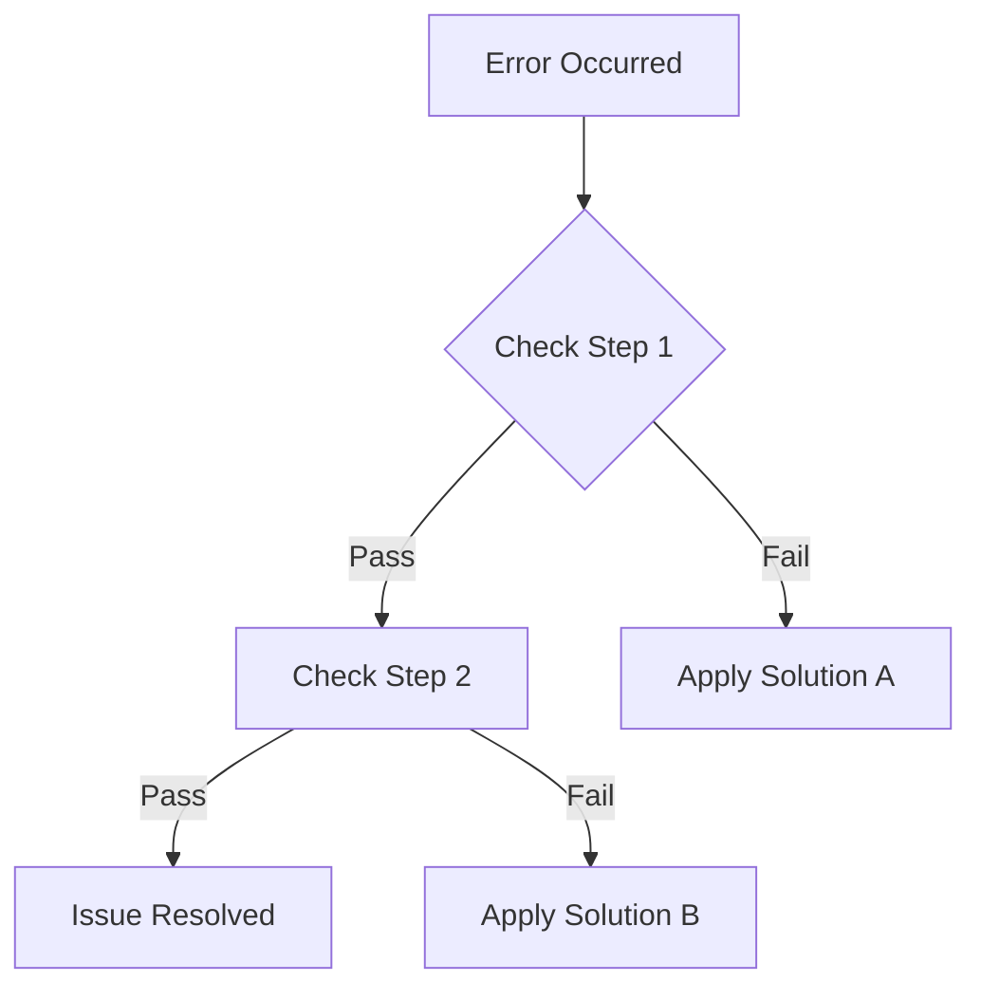

# /advisor:troubleshoot Command Specification

## Overview
The `/advisor:troubleshoot` command provides structured error analysis and resolution guidance workflow, routing error reports through the error-handler agent for expert-level troubleshooting assistance.

## Command Syntax
```bash
/advisor:troubleshoot [error_description] [--options]
```

## Parameters

### Required Parameters
- **error_description**: Natural language description of the error or issue
  - Example: "Getting permission denied errors during collector setup"
  - Example: "My collector isn't receiving any traffic"
  - Example: "API Gateway logs not appearing in CloudWatch"

### Optional Parameters
```yaml
optional_flags:
  --cloud-provider: "aws" | "azure" | "gcp"
    description: "Specify cloud provider for targeted troubleshooting"
    example: "/advisor:troubleshoot 'permission errors' --cloud-provider aws"

  --service-type: string
    description: "Specify service type experiencing issues"
    example: "/advisor:troubleshoot 'connectivity issues' --service-type api-gateway"

  --error-code: string
    description: "Specific error code or HTTP status code"
    example: "/advisor:troubleshoot 'authentication failed' --error-code 403"

  --deployment-stage: "pre_deployment" | "during_deployment" | "post_deployment"
    description: "Stage when error occurred"
    example: "/advisor:troubleshoot 'setup failure' --deployment-stage during_deployment"

  --urgency: "low" | "medium" | "high" | "critical"
    description: "Urgency level of the issue"
    default: "medium"
    example: "/advisor:troubleshoot 'production down' --urgency critical"

  --include-diagnostics: boolean
    description: "Include diagnostic commands and steps"
    default: true
    example: "/advisor:troubleshoot 'network issues' --include-diagnostics"

  --verbose: boolean
    description: "Provide detailed troubleshooting steps"
    default: false
    example: "/advisor:troubleshoot 'configuration error' --verbose"
```

## Command Processing Workflow

### Phase 1: Error Analysis and Classification
```yaml
error_processing:
  input_analysis:
    - extract_error_indicators: "Identify key error terms and patterns"
    - classify_error_category: "Categorize error type (auth, network, config, performance)"
    - assess_error_severity: "Determine impact and urgency level"
    - identify_affected_components: "Map error to specific system components"

  context_enrichment:
    - map_to_architecture: "Connect error to customer's architecture context"
    - identify_deployment_context: "Understand deployment stage and configuration"
    - extract_timing_information: "Understand when error occurred"
    - correlate_with_recent_changes: "Check for related recent changes"
```

### Phase 2: Orchestrator Integration
```yaml
orchestrator_handoff:
  context_preparation:
    conversation_context:
      command_invoked: "/advisor:troubleshoot"
      error_description: original_error_description
      error_classification: automated_classification_results
      affected_services: identified_from_parameters_and_description

    error_context:
      error_messages: [extracted_error_messages]
      symptoms_described: [symptom_list]
      deployment_stage: from_parameter_or_inferred
      affected_components: [component_list]

  orchestrator_invocation:
    tool_call: "Task"
    subagent_type: "general-purpose"
    prompt_construction:
      agent_identification: "You are the orchestrator agent"
      command_context: "Processing /advisor:troubleshoot command"
      error_report: original_error_description
      parameter_context: extracted_parameters
      expected_workflow: "Route to error-handler sub-agent"
```

### Phase 3: Response Processing and Formatting
```yaml
response_processing:
  error_handler_response_parsing:
    - extract_error_analysis: "Parse error classification and root cause analysis"
    - extract_solution_recommendations: "Get primary and alternative solutions"
    - extract_diagnostic_steps: "Get step-by-step diagnostic procedures"
    - extract_prevention_guidance: "Get future prevention recommendations"

  output_formatting:
    standard_format:
      - error_summary: "Clear summary of identified issue"
      - root_cause_analysis: "Explanation of likely root cause"
      - solution_steps: "Step-by-step resolution procedure"
      - validation_steps: "How to verify the fix worked"
      - prevention_measures: "How to prevent recurrence"

    verbose_format:
      - include_standard_format: "All standard content"
      - detailed_diagnostics: "Comprehensive diagnostic procedures"
      - alternative_solutions: "Multiple solution approaches"
      - troubleshooting_flowchart: "Decision tree for complex issues"
      - escalation_criteria: "When to escalate to support"
```

## Response Format Specifications

### Standard Response Format
```markdown
# Troubleshooting Analysis

## Error Summary
**Issue**: [Clear description of the identified issue]
**Category**: [Authentication/Network/Configuration/Performance]
**Severity**: [Low/Medium/High/Critical]
**Affected Components**: [List of affected components]

## Root Cause Analysis
[Explanation of the likely root cause based on symptoms]

## Recommended Solution
### Step 1: [Action Title]
```bash
[Specific command or action]
```
**Expected Result**: [What should happen]
**If this fails**: [Alternative or next step]

### Step 2: [Next Action]
[Continue with numbered steps...]

## Verification Steps
- [ ] [Verification step 1]
- [ ] [Verification step 2]
- [ ] [Final confirmation test]

## Prevention Measures
- [Recommendation 1 to prevent recurrence]
- [Recommendation 2 for monitoring]
- [Best practice to implement]

## Additional Resources
- [Link to relevant documentation]
- [Related troubleshooting guides]
```

### Verbose Response Format (with --verbose)
```markdown
# Comprehensive Troubleshooting Guide

## Detailed Error Analysis
### Symptoms Identified
- [Symptom 1 with analysis]
- [Symptom 2 with analysis]

### Error Pattern Matching
**Pattern**: [Matched error pattern]
**Confidence**: [High/Medium/Low]
**Historical Success Rate**: [Percentage]

### Architecture Context
[How the error relates to the specific architecture]

## Diagnostic Procedures
### Phase 1: Initial Diagnosis
```bash
# Step 1: Check service status
[diagnostic command 1]

# Step 2: Verify configuration
[diagnostic command 2]
```

### Phase 2: Detailed Investigation
[Continue with detailed diagnostic steps...]

## Solution Options
### Primary Solution (Recommended)
**Success Probability**: [Percentage]
**Estimated Time**: [Time estimate]
**Required Expertise**: [Beginner/Intermediate/Expert]

[Detailed solution steps...]

### Alternative Solution
**When to use**: [Conditions for using this approach]
[Alternative solution steps...]

## Troubleshooting Decision Tree


## Escalation Guidelines
**Escalate if**:
- Solution doesn't work after 3 attempts
- Error pattern is not recognized
- Issue affects production systems
- Additional expertise required

**When escalating, provide**:
- Complete error description
- Steps already attempted
- Current system status
- Business impact assessment
```

### Critical Issue Response Format (with --urgency critical)
```markdown
# 🚨 CRITICAL ISSUE TROUBLESHOOTING

## IMMEDIATE ACTIONS REQUIRED

### ⏰ First 5 Minutes
1. **[Critical Step 1]** - [Immediate action to stabilize]
2. **[Critical Step 2]** - [Immediate action to restore service]

### 📊 Impact Assessment
- **Services Affected**: [List]
- **Users Impacted**: [Estimate]
- **Business Impact**: [Assessment]

### 🔧 Emergency Resolution
[Most likely quick fix with commands]

### 📋 Immediate Validation
- [ ] [Critical validation step]
- [ ] [Service restoration check]

### 🚀 Next Steps
[What to do after immediate resolution]

---

## Detailed Analysis
[Standard troubleshooting format follows...]
```

## Error Pattern Recognition

### Common Error Categories and Responses
```yaml
error_categories:
  authentication_authorization:
    patterns:
      - "permission denied"
      - "403 forbidden"
      - "unauthorized"
      - "invalid credentials"
      - "access denied"

    common_solutions:
      - verify_iam_permissions: "Check and update IAM/RBAC permissions"
      - rotate_credentials: "Generate new API keys or tokens"
      - service_account_config: "Configure service account permissions"

  network_connectivity:
    patterns:
      - "connection timeout"
      - "network unreachable"
      - "dns resolution failed"
      - "ssl handshake failed"
      - "connection refused"

    common_solutions:
      - check_security_groups: "Verify security group/firewall rules"
      - test_connectivity: "Test network connectivity at different layers"
      - verify_dns: "Check DNS configuration and resolution"

  configuration_errors:
    patterns:
      - "invalid configuration"
      - "schema validation failed"
      - "parameter missing"
      - "resource not found"
      - "version mismatch"

    common_solutions:
      - validate_configuration: "Verify configuration against schema"
      - check_resource_names: "Verify resource names and references"
      - update_versions: "Align component versions"

  performance_issues:
    patterns:
      - "slow response"
      - "timeout"
      - "high latency"
      - "resource exhaustion"
      - "out of memory"

    common_solutions:
      - scale_resources: "Increase resource allocation"
      - optimize_configuration: "Tune performance parameters"
      - implement_caching: "Add appropriate caching layers"
```

### Architecture-Specific Troubleshooting
```yaml
cloud_specific_guidance:
  aws_troubleshooting:
    common_issues:
      - cloudwatch_logs_missing: "API Gateway CloudWatch integration issues"
      - lambda_cold_starts: "Lambda function performance issues"
      - iam_permission_errors: "IAM role and policy configuration"

    diagnostic_commands:
      - "aws sts get-caller-identity"
      - "aws logs describe-log-groups"
      - "aws iam get-role-policy"

  azure_troubleshooting:
    common_issues:
      - apim_vnet_connectivity: "APIM virtual network connectivity"
      - application_insights_missing: "Application Insights integration"
      - managed_identity_issues: "Managed identity configuration"

    diagnostic_commands:
      - "az account show"
      - "az apim show"
      - "az network nsg rule list"

  gcp_troubleshooting:
    common_issues:
      - api_gateway_auth: "API Gateway authentication configuration"
      - service_account_permissions: "Service account IAM issues"
      - cloud_logging_missing: "Cloud Logging integration"

    diagnostic_commands:
      - "gcloud auth list"
      - "gcloud projects get-iam-policy"
      - "gcloud logging logs list"
```

## Error Handling and Recovery

### Command-Level Error Handling
```yaml
error_scenarios:
  invalid_error_description:
    empty_description:
      error_message: "Error description is required"
      suggestion: "Please describe the issue you're experiencing"
      example: "/advisor:troubleshoot 'Getting 403 errors when accessing API'"

    vague_description:
      warning_message: "Description is quite general - more details would help"
      prompt_for_details: "Can you provide specific error messages or symptoms?"

  parameter_validation_errors:
    invalid_cloud_provider:
      error_message: "Invalid cloud provider specified"
      valid_options: ["aws", "azure", "gcp"]

    invalid_urgency_level:
      error_message: "Invalid urgency level"
      valid_options: ["low", "medium", "high", "critical"]

  processing_errors:
    error_handler_failure:
      error_message: "Unable to analyze error pattern"
      fallback_action: "Providing general troubleshooting guidance"

    insufficient_context:
      error_message: "Need more context to provide specific troubleshooting"
      interactive_prompt: "Please provide additional details about your setup and the error"
```

### Escalation Handling
```yaml
escalation_scenarios:
  automatic_escalation:
    critical_urgency:
      - immediate_notification: "Alert support team for critical issues"
      - priority_routing: "Route to senior troubleshooting specialists"
      - follow_up_tracking: "Track resolution progress"

    unknown_error_patterns:
      - pattern_learning: "Log new error pattern for future learning"
      - expert_consultation: "Route to expert for analysis"
      - solution_documentation: "Document resolution for future use"

  user_requested_escalation:
    - preserve_context: "Maintain all troubleshooting context"
    - provide_summary: "Summarize attempted solutions"
    - include_impact_assessment: "Include business impact information"
```

## Integration Points

### Error Handler Agent Integration
```yaml
error_handler_coordination:
  request_mapping:
    command_parameters_to_context:
      error_description: "user_query"
      cloud_provider: "conversation_context.cloud_provider"
      service_type: "conversation_context.services_mentioned"
      error_code: "error_context.error_messages"
      deployment_stage: "error_context.deployment_stage"

  response_processing:
    error_handler_output_mapping:
      error_analysis: "error_classification and root_cause_hypothesis"
      solution_steps: "primary_solution.resolution_steps"
      diagnostics: "troubleshooting_workflow.diagnostic_steps"
      validation: "troubleshooting_workflow.validation_commands"

  quality_assurance:
    - verify_solution_completeness: "Ensure solution steps are complete"
    - validate_command_syntax: "Verify diagnostic commands are correct"
    - check_architecture_relevance: "Ensure solutions fit customer architecture"
```

### Session Context Integration
```yaml
session_integration:
  error_history_tracking:
    - maintain_error_log: "Keep track of all errors reported"
    - track_resolution_success: "Monitor whether solutions work"
    - learn_from_patterns: "Identify recurring issues"

  follow_up_optimization:
    - reference_previous_errors: "Connect related error reports"
    - avoid_redundant_diagnostics: "Skip already-completed diagnostic steps"
    - build_on_partial_solutions: "Continue from partially successful attempts"
```

## Usage Examples

### Basic Troubleshooting Examples
```bash
# General error description
/advisor:troubleshoot "My collector isn't collecting any traffic"

# Specific error message
/advisor:troubleshoot "Getting 'Permission denied' when trying to access CloudWatch logs"

# Performance issue
/advisor:troubleshoot "API responses are very slow since deploying the collector"
```

### Advanced Troubleshooting Examples
```bash
# Specify cloud provider and service
/advisor:troubleshoot "Authentication errors during setup" --cloud-provider aws --service-type api-gateway

# Include specific error code
/advisor:troubleshoot "HTTP errors from API Gateway" --error-code 502 --deployment-stage post_deployment

# Critical production issue
/advisor:troubleshoot "Production API Gateway completely down" --urgency critical --include-diagnostics

# Verbose troubleshooting for complex issues
/advisor:troubleshoot "Intermittent connectivity issues" --verbose --cloud-provider azure
```

### Complex Scenario Examples
```bash
# Multi-parameter troubleshooting request
/advisor:troubleshoot "Collector deployment failing with network errors" \
  --cloud-provider aws \
  --service-type api-gateway \
  --deployment-stage during_deployment \
  --error-code 403 \
  --urgency high \
  --verbose

# Quick diagnostic for experienced users
/advisor:troubleshoot "APIM not logging to Application Insights" \
  --cloud-provider azure \
  --include-diagnostics \
  --urgency medium
```

## Performance Considerations

### Response Time Targets
```yaml
performance_targets:
  standard_troubleshooting: "< 20 seconds"
  verbose_troubleshooting: "< 35 seconds"
  critical_issue_response: "< 10 seconds"
  diagnostic_command_generation: "< 15 seconds"
```

### Optimization Strategies
```yaml
optimization_strategies:
  pattern_matching_optimization:
    - index_common_errors: "Pre-index frequently occurring error patterns"
    - cache_solution_mappings: "Cache error-to-solution mappings"
    - parallel_pattern_analysis: "Analyze multiple error patterns simultaneously"

  response_prioritization:
    - critical_issue_fast_path: "Prioritize critical issues for immediate response"
    - common_error_shortcuts: "Fast-track common, well-understood errors"
    - progressive_detail_loading: "Provide initial guidance quickly, then add details"
```