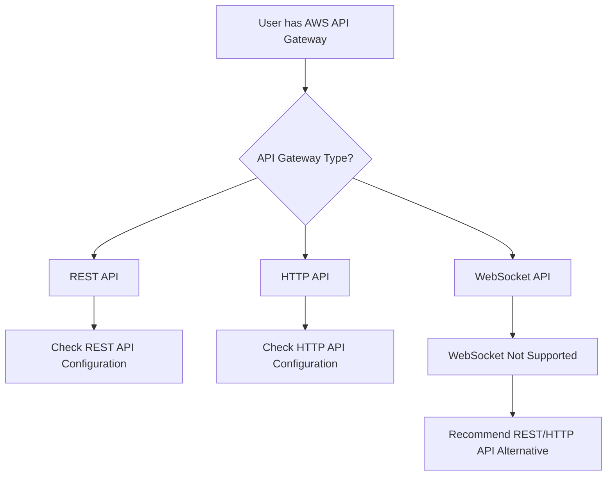
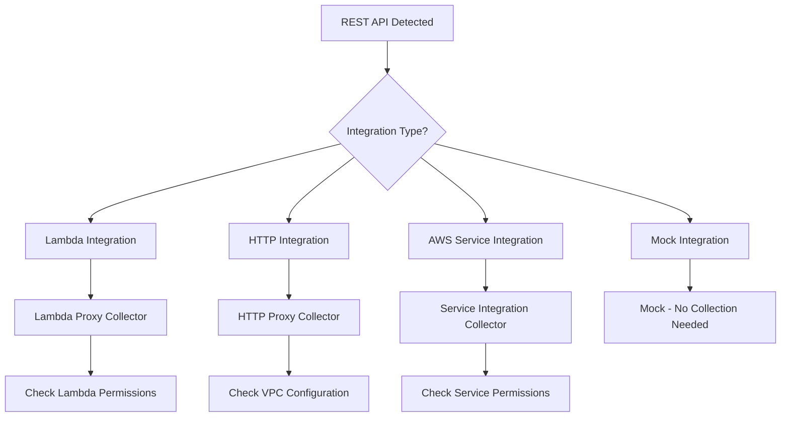
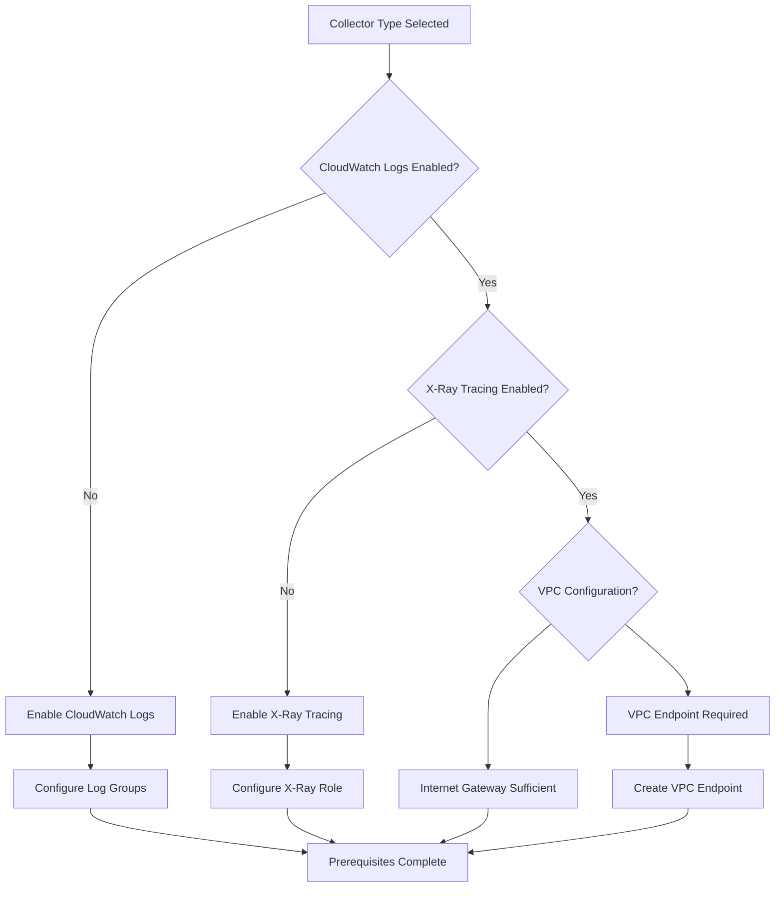
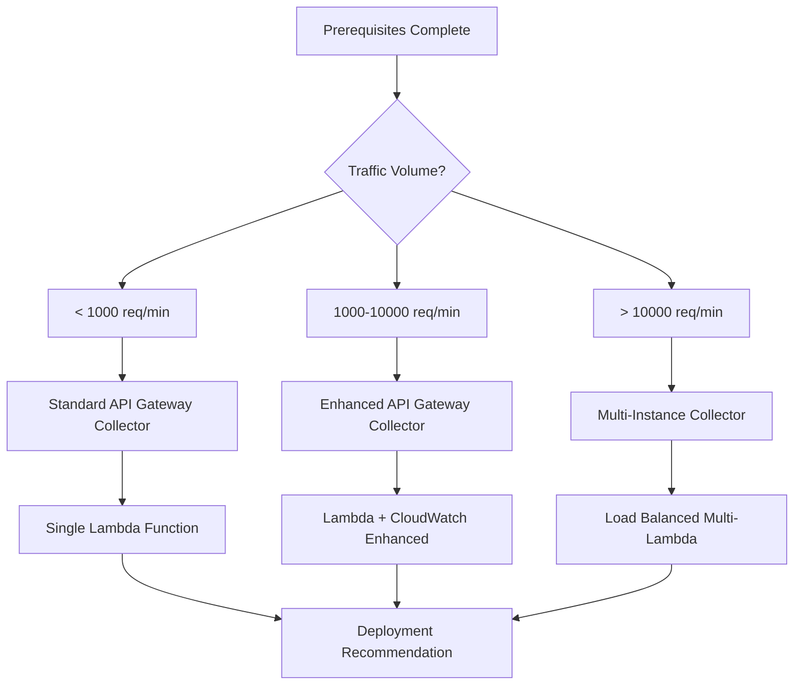

# AWS API Gateway Deployment Decision Tree

## Overview
Decision flowchart for AWS API Gateway traffic collection deployment with collector recommendations and prerequisites validation.

## Decision Flow

### Step 1: API Gateway Type Detection


### Step 2: REST API Configuration Analysis


### Step 3: Prerequisites Validation


### Step 4: Collector Recommendation


## Decision Logic

### Collector Selection Criteria

#### Standard API Gateway Collector
**Use When:**
- Traffic volume < 1000 requests/minute
- Simple REST API with Lambda integration
- Basic monitoring requirements
- Single region deployment

**Prerequisites:**
- CloudWatch Logs enabled
- Lambda execution role with CloudWatch permissions
- API Gateway CloudWatch role configured

**Deployment Complexity:** Beginner (2/10)
**Success Probability:** 95%
**Time Estimate:** 1-2 hours

#### Enhanced API Gateway Collector
**Use When:**
- Traffic volume 1000-10000 requests/minute
- Multiple integration types
- Advanced monitoring and tracing required
- Multi-stage deployment (dev/staging/prod)

**Prerequisites:**
- CloudWatch Logs with detailed monitoring
- X-Ray tracing enabled
- VPC configuration if private APIs
- Enhanced CloudWatch metrics

**Deployment Complexity:** Intermediate (5/10)
**Success Probability:** 90%
**Time Estimate:** 3-4 hours

#### Multi-Instance Collector
**Use When:**
- Traffic volume > 10000 requests/minute
- High availability requirements
- Multi-region deployment
- Complex API architecture

**Prerequisites:**
- Load balancer configuration
- Cross-region replication
- Advanced monitoring setup
- Dedicated VPC setup

**Deployment Complexity:** Expert (8/10)
**Success Probability:** 85%
**Time Estimate:** 6-8 hours

### Common Gotchas and Solutions

#### Issue: CloudWatch Logs Not Appearing
**Symptoms:** Collector deployed but no traffic logs
**Solution:** Verify API Gateway CloudWatch role has correct permissions
**Check:** API Gateway stage logging configuration

#### Issue: Lambda Cold Start Delays
**Symptoms:** High latency on first requests
**Solution:** Implement Lambda warming or provisioned concurrency
**Prevention:** Use Enhanced collector for consistent traffic

#### Issue: VPC Endpoint Connectivity
**Symptoms:** Timeouts on private API calls
**Solution:** Verify VPC endpoint routing and security groups
**Check:** DNS resolution within VPC

### Integration Points

#### With Deployment Advisor Agent
```yaml
flowchart_consultation:
  input_entities:
    - api_gateway_type: "rest" | "http" | "websocket"
    - integration_type: "lambda" | "http" | "aws_service" | "mock"
    - traffic_volume: number
    - vpc_configuration: boolean

  output_recommendation:
    collector_type: string
    complexity_score: 1-10
    prerequisites: array
    estimated_time: string
    success_probability: percentage
```

#### With Validator Agent
```yaml
validation_checkpoints:
  - cloudwatch_logs_enabled
  - xray_tracing_configured
  - lambda_permissions_correct
  - api_gateway_stage_logging
  - vpc_endpoint_accessibility
```