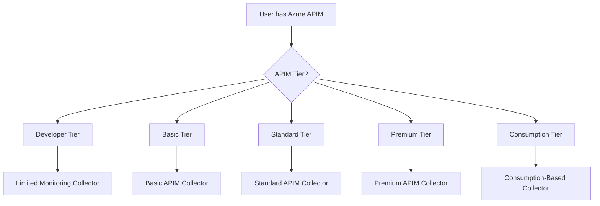
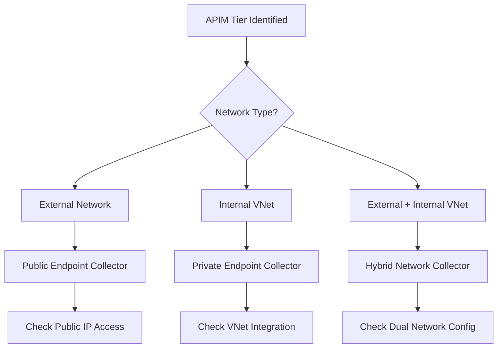
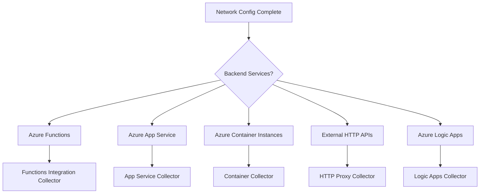
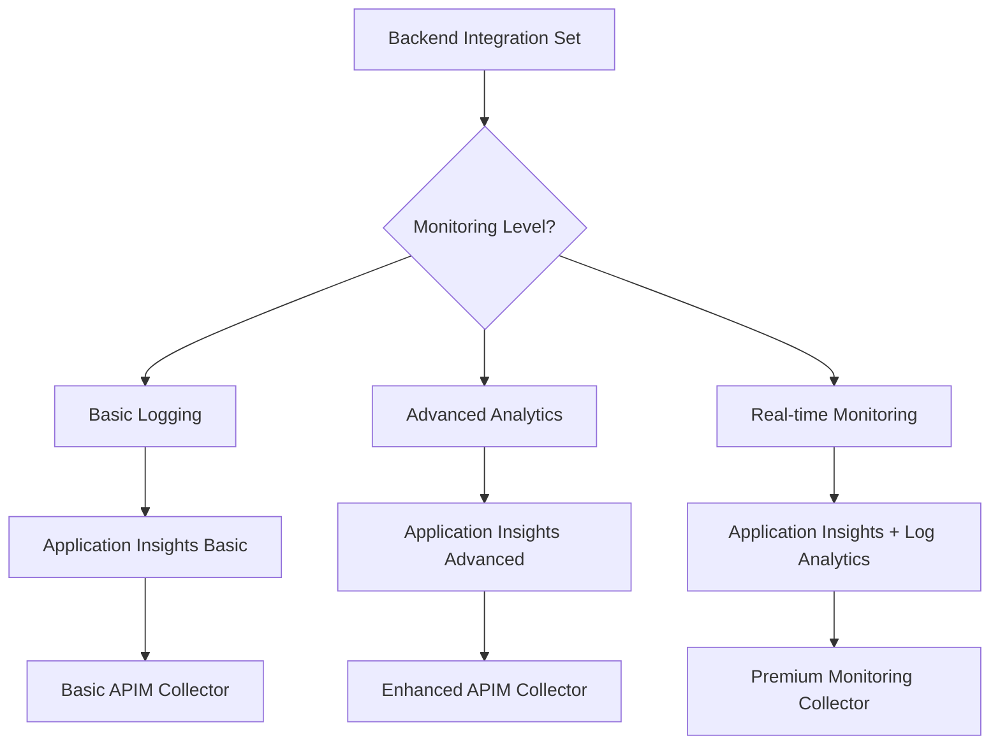

# Azure APIM Deployment Decision Tree

## Overview
Decision flowchart for Azure API Management traffic collection deployment with collector recommendations and architecture-specific guidance.

## Decision Flow

### Step 1: APIM Tier Detection


### Step 2: Network Configuration Analysis


### Step 3: Backend Service Analysis


### Step 4: Monitoring Requirements


## Decision Logic

### Collector Selection by Tier

#### Developer Tier Collector
**Use When:**
- Development and testing environments
- Single developer access
- Basic API operations
- No SLA requirements

**Prerequisites:**
- Application Insights resource
- Basic Azure Monitor permissions
- Developer tier APIM instance

**Deployment Complexity:** Beginner (3/10)
**Success Probability:** 95%
**Time Estimate:** 1 hour
**Limitations:** No virtual network support, 1 unit scale only

#### Standard Tier Collector
**Use When:**
- Production workloads with moderate traffic
- Virtual network integration needed
- Multiple developer access
- Basic SLA requirements (99.9%)

**Prerequisites:**
- Application Insights with custom telemetry
- Virtual Network configured (if internal)
- Azure Monitor Log Analytics workspace
- Custom domain certificates (if HTTPS)

**Deployment Complexity:** Intermediate (5/10)
**Success Probability:** 90%
**Time Estimate:** 3-4 hours

#### Premium Tier Collector
**Use When:**
- High-scale production workloads
- Multi-region deployment
- Advanced networking (ExpressRoute/VPN)
- Enterprise SLA requirements (99.95%)

**Prerequisites:**
- Multi-region Application Insights
- Advanced Virtual Network setup
- ExpressRoute or VPN Gateway
- Azure Key Vault for certificates
- Advanced threat protection

**Deployment Complexity:** Expert (8/10)
**Success Probability:** 85%
**Time Estimate:** 6-8 hours

### Network-Specific Configurations

#### External Network Setup
```yaml
network_config:
  type: "external"
  collector: "public_endpoint"
  requirements:
    - public_ip_allowed: true
    - firewall_rules: "configure_inbound"
    - ssl_certificate: "required_for_https"
  monitoring_points:
    - gateway_requests
    - backend_responses
    - public_endpoint_access
```

#### Internal VNet Setup
```yaml
network_config:
  type: "internal_vnet"
  collector: "private_endpoint"
  requirements:
    - vnet_integration: true
    - subnet_configuration: "dedicated_subnet"
    - nsg_rules: "configure_internal"
    - private_dns: "configure_zones"
  monitoring_points:
    - internal_gateway_access
    - vnet_traffic_flow
    - backend_connectivity
```

### Backend Integration Patterns

#### Azure Functions Integration
**Collector Type:** Functions Integration Collector
**Monitoring Focus:**
- Function execution times
- Cold start detection
- Consumption plan scaling
- Function app insights correlation

**Configuration:**
```yaml
functions_integration:
  monitoring_keys:
    - function_execution_time
    - invocation_count
    - error_rate
    - cold_start_frequency
  correlation:
    - operation_id_tracking: true
    - request_telemetry: "detailed"
```

#### App Service Integration
**Collector Type:** App Service Collector
**Monitoring Focus:**
- Application performance metrics
- App Service plan scaling
- Deployment slot monitoring
- Custom application insights

**Configuration:**
```yaml
app_service_integration:
  monitoring_keys:
    - response_time
    - throughput
    - error_percentage
    - availability
  scaling_metrics:
    - cpu_percentage
    - memory_percentage
    - http_queue_length
```

### Common Configuration Issues

#### Issue: Application Insights Not Receiving Data
**Symptoms:** APIM collector deployed but no telemetry
**Causes:**
- Application Insights instrumentation key incorrect
- APIM diagnostic settings not configured
- Network connectivity issues to Application Insights

**Solution Steps:**
1. Verify Application Insights instrumentation key
2. Configure APIM diagnostic settings for Application Insights
3. Test connectivity from APIM to Application Insights endpoint
4. Check Azure Monitor permissions

#### Issue: Virtual Network Connectivity Problems
**Symptoms:** Backend services unreachable through APIM
**Causes:**
- NSG rules blocking traffic
- Route table misconfiguration
- Private DNS resolution issues

**Solution Steps:**
1. Verify NSG allows APIM subnet to backend subnet
2. Check User Defined Routes (UDR)
3. Configure private DNS zones for backend services
4. Test connectivity using Network Watcher

#### Issue: SSL/TLS Certificate Problems
**Symptoms:** HTTPS endpoints failing or certificate warnings
**Causes:**
- Certificate not uploaded to APIM
- Certificate chain incomplete
- Key Vault permissions incorrect

**Solution Steps:**
1. Upload complete certificate chain to APIM
2. Configure Key Vault access policies
3. Verify certificate expiration dates
4. Test SSL configuration with external tools

### Integration Points

#### With Deployment Advisor Agent
```yaml
apim_consultation:
  input_entities:
    - apim_tier: "developer" | "basic" | "standard" | "premium" | "consumption"
    - network_type: "external" | "internal" | "hybrid"
    - backend_services: array
    - traffic_volume: number
    - sla_requirements: string

  output_recommendation:
    collector_type: string
    network_configuration: object
    monitoring_setup: array
    complexity_score: 1-10
    estimated_deployment_time: string
```

#### With Validator Agent
```yaml
apim_validation_checkpoints:
  - apim_instance_running
  - application_insights_connected
  - diagnostic_settings_configured
  - network_connectivity_verified
  - ssl_certificates_valid
  - backend_services_reachable
  - api_policies_applied
```