# Basic Salt Security Deployment Flow

## Overview
This flowchart represents the basic deployment decision tree for Salt Security traffic collection across different AWS services and deployment methods.

## Decision Tree

```mermaid
flowchart TD
    Start([Connect Cloud]) --> Decision{Deployment Method}

    %% Read Only Path
    Decision -->|Read Only| ReadOnly[Read Only]
    ReadOnly --> ReadDiscovery[Resource Discovery]
    ReadDiscovery --> ReadServices{Service Type}

    %% Read Only Services
    ReadServices -->|ALB| ALB1[ALB]
    ReadServices -->|CloudFront| CF1[CloudFront]
    ReadServices -->|WAF| WAF1[WAF]
    ReadServices -->|EKS| EKS1[EKS]
    ReadServices -->|API Gateway| APIG1[API Gateway]

    %% Read Only ALB Flow
    ALB1 --> ManualALB{Manual?}
    ManualALB -->|Yes| EncryptedALB{Encrypted?}
    ManualALB -->|No| SaltSensorALB[Salt Sensor]
    EncryptedALB -->|Yes| SensorALB[Sensor]
    EncryptedALB -->|No| VPCMirrorALB[VPC Mirror]

    %% Read Only CloudFront Flow
    CF1 --> ManualCF{Manual?}
    ManualCF -->|Yes| LambdaEdge1[Lambda @Edge]
    ManualCF -->|No| SaltSensorCF[Salt Sensor]

    %% Read Only EKS Flow
    EKS1 --> ManualEKS{Manual?}
    ManualEKS -->|Yes| SaltSensorEKS[Salt Sensor]
    ManualEKS -->|No| SaltSensorEKS

    %% Read Only API Gateway Flow
    APIG1 --> ManualAPIG{Manual?}
    ManualAPIG -->|Yes| SaltSensorAPIG[Salt Sensor]
    ManualAPIG -->|No| SaltSensorAPIG

    %% Read + Write Path
    Decision -->|Read + Write| ReadWrite[Read + Write]
    ReadWrite --> WriteDiscovery[Resource Discovery]
    WriteDiscovery --> WriteServices{Service Type}

    %% Read + Write Services
    WriteServices -->|ALB| ALB2[ALB]
    WriteServices -->|CloudFront| CF2[CloudFront]
    WriteServices -->|WAF| WAF2[WAF]
    WriteServices -->|EKS| EKS2[EKS]
    WriteServices -->|API Gateway| APIG2[API Gateway]

    %% Read + Write ALB Flow
    ALB2 --> DeployLogCollector1[Deploy Log Collector]
    DeployLogCollector1 --> EncryptedALB2{Encrypted?}
    EncryptedALB2 -->|No| FullVisibility1{Full visibility?}
    EncryptedALB2 -->|Yes| SensorALB2[Sensor]
    FullVisibility1 -->|Yes| SensorALB3[Sensor]
    FullVisibility1 -->|No| VPCMirrorALB2[VPC Mirror]

    %% Read + Write CloudFront Flow
    CF2 --> DeployLogCollector2[Deploy Log Collector]
    DeployLogCollector2 --> LambdaEdge2[Lambda @Edge]

    %% Read + Write WAF Flow
    WAF2 --> SaltSensorWAF2[Salt Sensor]

    %% Read + Write EKS Flow
    EKS2 --> SaltSensorEKS2[Salt Sensor]

    %% Read + Write API Gateway Flow
    APIG2 --> RESTorHTTP{REST or HTTP?}
    RESTorHTTP -->|REST| CloudWatchPath[via CloudWatch]
    RESTorHTTP -->|HTTP| LambdaExtPath[via Lambda Extension]
    CloudWatchPath --> SaltSensorREST[Salt Sensor]
    LambdaExtPath --> SaltSensorHTTP[Salt Sensor]

    %% Additional Read + Write Flow
    SensorALB2 --> DeployLogCollector3[Deploy Log Collector]
    VPCMirrorALB2 --> DeployLogCollector3
    DeployLogCollector3 --> FullVisibility2{Full visibility?}

    %% Legend
    subgraph Legend ["Legend"]
        PotentialSeamless["⭠ Potentially seamless"]
        Seamless["⭠ Seamless"]
        HighFriction["⭠ High Friction"]
        FullVis["Full Visibility"]
        PartialVis["Partial visibility"]
    end

    %% Styling
    classDef readOnlyStyle fill:#e1f5fe,stroke:#0277bd,stroke-width:2px,color:#000
    classDef readWriteStyle fill:#fff3e0,stroke:#f57c00,stroke-width:2px,color:#000
    classDef sensorStyle fill:#c8e6c9,stroke:#2e7d32,stroke-width:2px,color:#000
    classDef collectorStyle fill:#fff9c4,stroke:#f9a825,stroke-width:2px,color:#000
    classDef decisionStyle fill:#f3e5f5,stroke:#7b1fa2,stroke-width:2px,color:#000

    class ReadOnly,ReadDiscovery,ReadServices readOnlyStyle
    class ReadWrite,WriteDiscovery,WriteServices readWriteStyle
    class SaltSensorALB,SaltSensorCF,SaltSensorEKS,SaltSensorAPIG,SaltSensorWAF2,SaltSensorEKS2,SensorALB,SensorALB2,SensorALB3,SaltSensorREST,SaltSensorHTTP sensorStyle
    class DeployLogCollector1,DeployLogCollector2,DeployLogCollector3 collectorStyle
    class Decision,ManualALB,ManualCF,ManualEKS,ManualAPIG,EncryptedALB,EncryptedALB2,FullVisibility1,FullVisibility2,RESTorHTTP decisionStyle
```

## Flow Description

### Read Only Path
- **Resource Discovery**: Scans existing AWS resources
- **Service Detection**: Identifies ALB, CloudFront, WAF, EKS, and API Gateway services
- **Deployment Method**: Determines manual vs automatic sensor deployment
- **Traffic Collection**: Uses Salt Sensors for seamless collection or VPC Mirror/Lambda@Edge for specific scenarios

### Read + Write Path
- **Resource Discovery**: Scans and can modify AWS resources
- **Log Collector Deployment**: Deploys log collectors for enhanced visibility
- **Enhanced Options**: Provides full visibility options with sensor and VPC mirror combinations
- **Protocol-Specific Handling**: Different approaches for REST vs HTTP API Gateways

## Key Decision Points

1. **Deployment Method**: Read Only vs Read + Write permissions
2. **Manual Configuration**: Whether manual setup is required
3. **Traffic Encryption**: Affects sensor placement options
4. **Full Visibility**: Determines if comprehensive monitoring is needed
5. **API Gateway Type**: REST vs HTTP affects collection method

## Integration Types

- **🟢 Seamless**: Direct sensor integration with minimal friction
- **🟡 Potentially Seamless**: May require some configuration
- **🔴 High Friction**: Requires significant manual setup
- **Full Visibility**: Complete traffic monitoring and analysis
- **Partial Visibility**: Limited monitoring capabilities

## Usage Notes

This flowchart should be consulted by the deployment-advisor agent when analyzing customer architectures and determining optimal collector deployment strategies. The decision points help identify the most appropriate collection method based on customer permissions, service types, and visibility requirements.