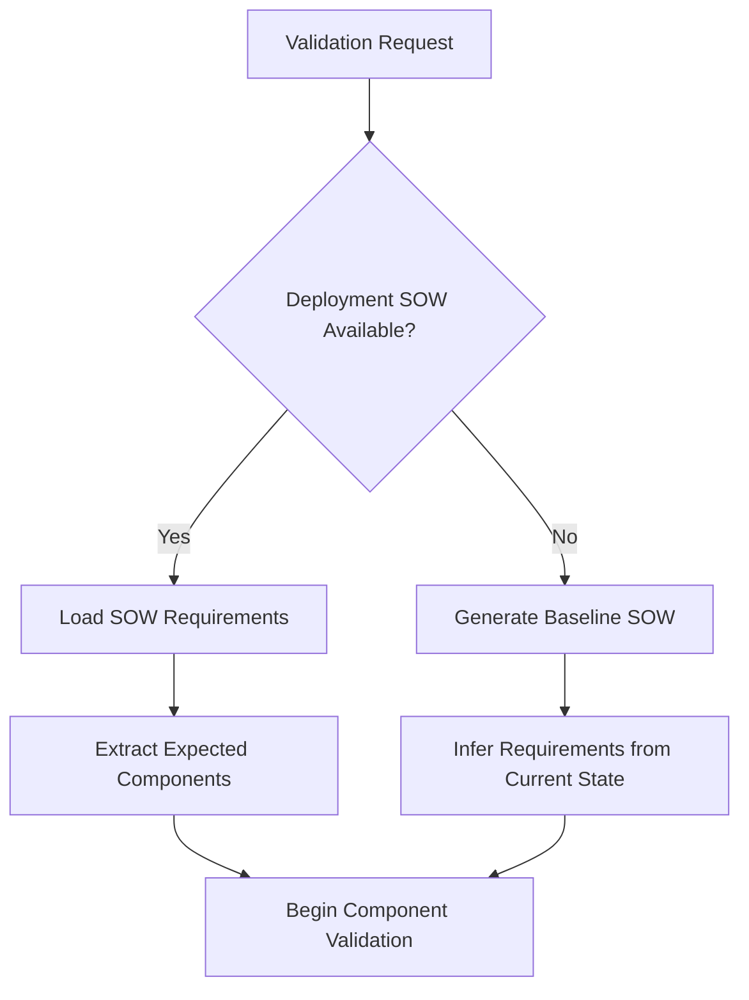
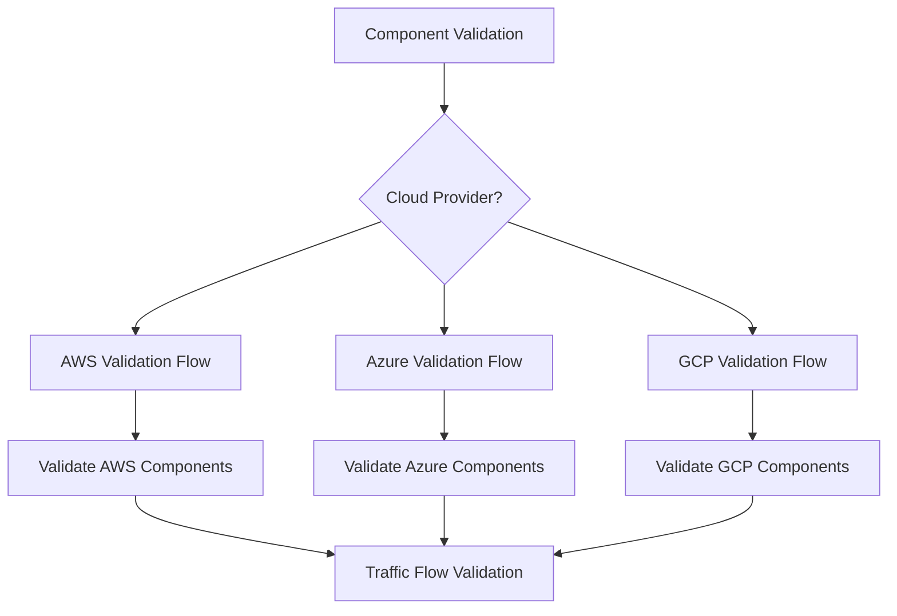
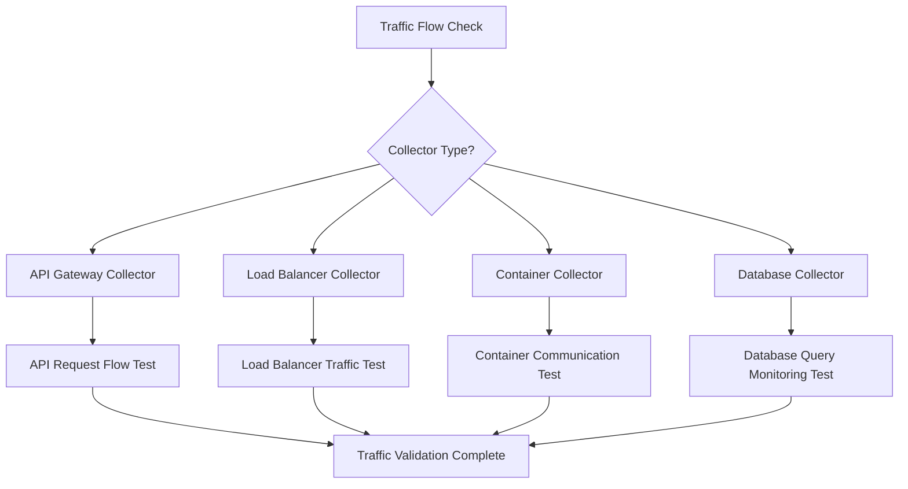

# Deployment Validation Decision Tree

## Overview
Comprehensive validation flowchart for verifying collector deployment success with SOW comparison logic and missing component identification.

## Validation Flow

### Step 1: Initial Deployment Status Check


### Step 2: Core Component Validation


### Step 3: Traffic Flow Validation


### Step 4: Monitoring and Alerting Validation
```mermaid
flowchart TD
    A[Monitoring Validation] --> B{Monitoring Platform?}
    B --> C[CloudWatch (AWS)]
    B --> D[Azure Monitor]
    B --> E[Cloud Operations (GCP)]

    C --> F[Validate CloudWatch Logs/Metrics]
    D --> G[Validate Application Insights]
    E --> H[Validate Cloud Logging/Monitoring]

    F --> I[Check Alert Configurations]
    G --> I
    H --> I

    I --> J[Monitoring Validation Complete]
```

## Validation Logic by Cloud Provider

### AWS Validation Checklist

#### API Gateway Collector Validation
```yaml
aws_api_gateway_validation:
  core_components:
    - api_gateway_exists: "Check API Gateway deployment"
    - lambda_function_exists: "Verify collector Lambda function"
    - iam_roles_configured: "Validate IAM permissions"
    - cloudwatch_logs_enabled: "Confirm logging configuration"

  traffic_flow:
    - api_endpoint_accessible: "Test API Gateway endpoint"
    - lambda_invocation_successful: "Verify Lambda execution"
    - logs_appearing: "Confirm traffic logging"
    - metrics_collecting: "Validate CloudWatch metrics"

  monitoring_setup:
    - cloudwatch_dashboards: "Check monitoring dashboards"
    - alarms_configured: "Verify alerting setup"
    - x_ray_tracing: "Validate distributed tracing"

validation_commands:
  - aws apigateway get-rest-apis
  - aws lambda list-functions
  - aws logs describe-log-groups
  - aws cloudwatch list-dashboards
```

#### Application Load Balancer Validation
```yaml
aws_alb_validation:
  core_components:
    - alb_exists: "Verify ALB deployment"
    - target_groups_healthy: "Check target group health"
    - listeners_configured: "Validate listener configuration"
    - security_groups_open: "Verify security group rules"

  traffic_flow:
    - health_checks_passing: "Confirm target health checks"
    - traffic_distribution: "Verify load balancing"
    - ssl_termination: "Test HTTPS configuration"

validation_commands:
  - aws elbv2 describe-load-balancers
  - aws elbv2 describe-target-health
  - aws ec2 describe-security-groups
```

### Azure Validation Checklist

#### APIM Collector Validation
```yaml
azure_apim_validation:
  core_components:
    - apim_instance_running: "Verify APIM service status"
    - api_published: "Confirm API publication"
    - application_insights_connected: "Check monitoring integration"
    - backend_services_accessible: "Validate backend connectivity"

  traffic_flow:
    - api_requests_successful: "Test API endpoint responses"
    - policies_applied: "Verify API policies execution"
    - rate_limiting_active: "Test throttling policies"

  monitoring_setup:
    - application_insights_telemetry: "Confirm telemetry collection"
    - log_analytics_workspace: "Verify log aggregation"
    - custom_dashboards: "Check monitoring dashboards"

validation_commands:
  - az apim show
  - az monitor app-insights component show
  - az monitor log-analytics workspace show
```

### GCP Validation Checklist

#### API Gateway Collector Validation
```yaml
gcp_api_gateway_validation:
  core_components:
    - gateway_deployed: "Verify API Gateway deployment"
    - config_active: "Check gateway configuration status"
    - backend_services_healthy: "Validate backend service health"
    - iam_permissions_correct: "Verify service account permissions"

  traffic_flow:
    - api_reachable: "Test API Gateway endpoint"
    - authentication_working: "Verify auth mechanisms"
    - backend_responses: "Confirm backend connectivity"

  monitoring_setup:
    - cloud_logging_active: "Verify log collection"
    - cloud_monitoring_metrics: "Check metric collection"
    - error_reporting: "Validate error tracking"

validation_commands:
  - gcloud api-gateway gateways list
  - gcloud logging logs list
  - gcloud monitoring dashboards list
```

## SOW Comparison Logic

### SOW Requirements Extraction
```yaml
sow_parsing:
  expected_components:
    - extract_from_markdown: "Parse SOW document structure"
    - identify_prerequisites: "List required components"
    - parse_configuration_items: "Extract config requirements"
    - extract_success_criteria: "Define validation checkpoints"

  deployment_options:
    - selected_option: "Identify chosen deployment path"
    - complexity_level: "Extract complexity assessment"
    - time_estimate: "Parse estimated deployment time"
    - success_probability: "Extract expected success rate"
```

### Gap Analysis Process
```yaml
gap_analysis:
  missing_components:
    discovery:
      - compare_expected_vs_actual: "Identify missing components"
      - categorize_gaps: "Group by criticality (critical/important/nice-to-have)"
      - estimate_impact: "Assess impact on functionality"

  configuration_diffs:
    analysis:
      - compare_settings: "Identify configuration mismatches"
      - validate_permissions: "Check access control settings"
      - verify_networking: "Validate network configuration"

  remediation_planning:
    recommendations:
      - prioritize_fixes: "Order by criticality and effort"
      - provide_fix_commands: "Generate remediation steps"
      - estimate_fix_time: "Calculate time to resolve gaps"
```

## Validation Report Generation

### Success Report Format
```yaml
validation_success_report:
  summary:
    status: "PASSED"
    total_checks: number
    passed_checks: number
    completion_percentage: percentage

  components_validated:
    - component_name: string
      status: "PASS" | "FAIL" | "WARNING"
      details: string
      validation_time: timestamp

  traffic_validation:
    - test_name: string
      result: "PASS" | "FAIL"
      response_time: milliseconds
      error_details: string | null

  recommendations:
    - priority: "HIGH" | "MEDIUM" | "LOW"
      action: string
      estimated_time: string
```

### Failure Report Format
```yaml
validation_failure_report:
  summary:
    status: "FAILED"
    critical_failures: number
    warning_count: number
    missing_components: array

  failed_components:
    - component_name: string
      expected: string
      actual: string | null
      error_message: string
      remediation_steps: array

  gap_analysis:
    missing_prerequisites:
      - prerequisite: string
        category: "critical" | "important" | "optional"
        installation_command: string
        estimated_time: string

    configuration_issues:
      - setting_name: string
        expected_value: any
        current_value: any
        fix_command: string

  next_steps:
    immediate_actions: array
    long_term_improvements: array
    escalation_criteria: string
```

## Common Validation Scenarios

### Scenario 1: Partial Deployment Success
**Situation:** Core components deployed but monitoring not configured
**Validation Result:** PARTIAL_SUCCESS
**Action Plan:**
1. Acknowledge successful core deployment
2. Identify missing monitoring components
3. Provide step-by-step monitoring setup
4. Re-validate after monitoring configuration

### Scenario 2: Traffic Flow Issues
**Situation:** Collector deployed but no traffic visible
**Validation Result:** TRAFFIC_FLOW_FAILURE
**Diagnostic Steps:**
1. Test endpoint accessibility
2. Check authentication/authorization
3. Verify network routing
4. Validate logging configuration
5. Test with known good traffic

### Scenario 3: Configuration Drift
**Situation:** Deployment differs from SOW specifications
**Validation Result:** CONFIGURATION_MISMATCH
**Resolution Process:**
1. Document all configuration differences
2. Assess impact of each difference
3. Provide commands to align with SOW
4. Update SOW if changes are intentional

## Integration Points

### With Deployment Advisor Agent
```yaml
validation_feedback_loop:
  success_feedback:
    - update_success_metrics: "Track successful deployment patterns"
    - refine_recommendations: "Improve future deployment advice"

  failure_feedback:
    - identify_common_issues: "Learn from validation failures"
    - update_prerequisites: "Refine prerequisite lists"
    - improve_guidance: "Enhance deployment instructions"
```

### With Error Handler Agent
```yaml
validation_error_handoff:
  critical_failures:
    - escalate_to_error_handler: "Transfer complex issues"
    - provide_context: "Share validation results"
    - request_troubleshooting: "Get specific resolution steps"

  validation_retry:
    - retry_after_fixes: "Re-validate after error resolution"
    - track_resolution_time: "Measure fix effectiveness"
```

### With Reporter Agent
```yaml
validation_reporting:
  success_documentation:
    - update_sow_status: "Mark deployment as validated"
    - generate_completion_report: "Create final deployment report"

  failure_documentation:
    - create_gap_analysis_report: "Document missing components"
    - generate_remediation_plan: "Create action plan document"
```