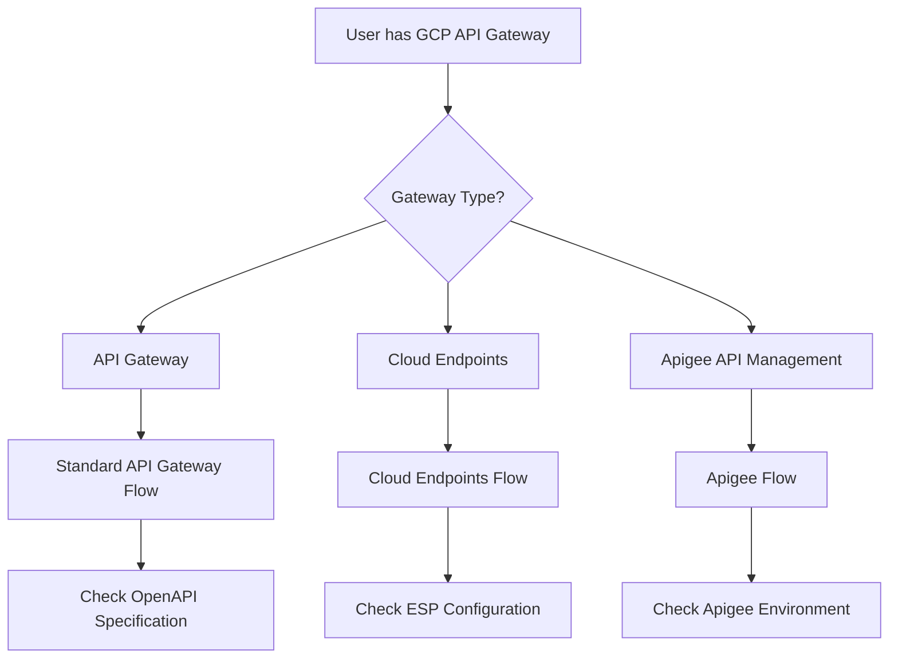
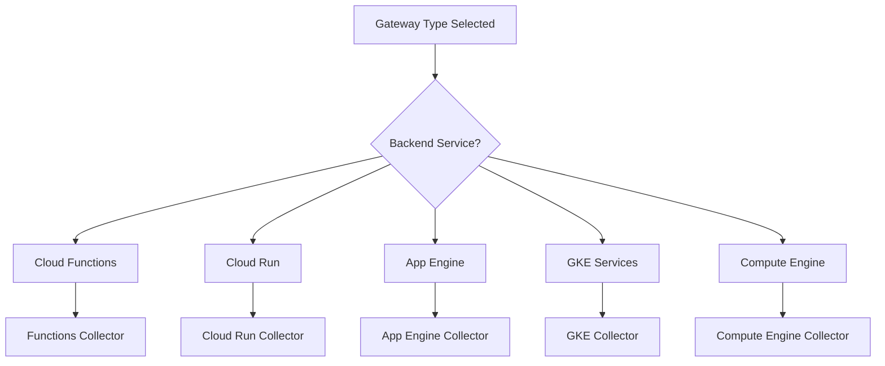
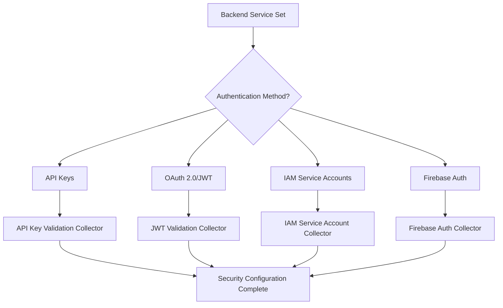
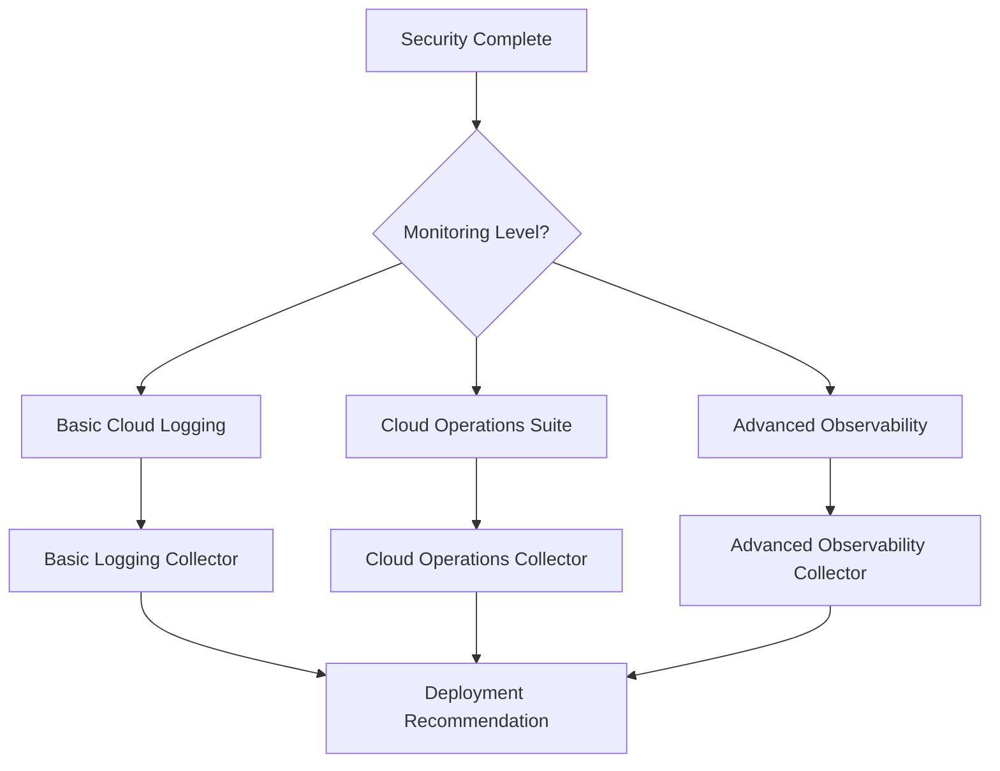

# GCP API Gateway Deployment Decision Tree

## Overview
Decision flowchart for Google Cloud API Gateway traffic collection deployment covering Google Cloud-specific deployment patterns and collector recommendations.

## Decision Flow

### Step 1: API Gateway Type Detection


### Step 2: Backend Service Analysis


### Step 3: Authentication & Security


### Step 4: Monitoring & Logging Setup


## Decision Logic

### API Gateway Collector Types

#### Standard API Gateway Collector
**Use When:**
- Using Google Cloud API Gateway service
- OpenAPI 3.0 specification-based APIs
- Moderate traffic volume (< 10,000 req/min)
- Standard authentication requirements

**Prerequisites:**
- Valid OpenAPI 3.0 specification
- Backend services deployed and accessible
- Cloud Logging API enabled
- API Gateway service enabled

**Deployment Complexity:** Intermediate (4/10)
**Success Probability:** 92%
**Time Estimate:** 2-3 hours

**Configuration:**
```yaml
standard_gateway:
  openapi_spec: "required"
  backend_services:
    - cloud_functions
    - cloud_run
    - app_engine
  authentication:
    - api_keys
    - jwt_validation
    - iam_service_accounts
  monitoring:
    - cloud_logging
    - cloud_monitoring
```

#### Cloud Endpoints Collector
**Use When:**
- Using Extensible Service Proxy (ESP)
- gRPC or REST APIs
- App Engine or GKE backends
- Advanced API management features needed

**Prerequisites:**
- ESP deployed with backend service
- Service configuration deployed
- Cloud Endpoints API enabled
- Appropriate IAM permissions

**Deployment Complexity:** Intermediate (5/10)
**Success Probability:** 88%
**Time Estimate:** 3-4 hours

**Configuration:**
```yaml
cloud_endpoints:
  esp_version: "2.x"
  api_types:
    - rest_api
    - grpc_api
  backends:
    - app_engine
    - gke_services
    - compute_engine
  features:
    - quota_management
    - api_keys
    - monitoring
```

#### Apigee Collector
**Use When:**
- Enterprise API management requirements
- Complex API policies and transformations
- Multi-environment deployment
- Advanced analytics and developer portal

**Prerequisites:**
- Apigee organization provisioned
- Environment and virtual hosts configured
- API proxies deployed
- Developer apps and API products setup

**Deployment Complexity:** Expert (8/10)
**Success Probability:** 85%
**Time Estimate:** 6-8 hours

**Configuration:**
```yaml
apigee_management:
  deployment_type: "hybrid" | "x" | "edge"
  environments:
    - dev
    - test
    - prod
  policies:
    - security
    - traffic_management
    - transformation
  analytics:
    - custom_reports
    - developer_insights
```

### Backend-Specific Configurations

#### Cloud Functions Integration
**Collector Focus:**
- Function invocation monitoring
- Cold start detection
- Error rate tracking
- Memory and execution time metrics

**Configuration:**
```yaml
cloud_functions_monitoring:
  metrics:
    - execution_count
    - execution_time
    - memory_usage
    - error_count
  tracing:
    - cloud_trace_enabled: true
    - sampling_rate: 0.1
  logging:
    - structured_logging: true
    - log_level: "INFO"
```

#### Cloud Run Integration
**Collector Focus:**
- Container startup time
- Request concurrency
- Auto-scaling metrics
- Service-to-service communication

**Configuration:**
```yaml
cloud_run_monitoring:
  metrics:
    - request_count
    - request_latencies
    - container_cpu_utilization
    - container_memory_utilization
  scaling:
    - min_instances: 0
    - max_instances: 100
    - concurrency: 1000
  networking:
    - vpc_connector_enabled: false
    - ingress: "all"
```

#### GKE Services Integration
**Collector Focus:**
- Pod performance metrics
- Service mesh observability (if using Istio)
- Cluster-level monitoring
- Ingress controller metrics

**Configuration:**
```yaml
gke_monitoring:
  cluster_monitoring: true
  workload_identity: true
  service_mesh:
    - istio_enabled: false
    - linkerd_enabled: false
  ingress:
    - nginx_ingress: true
    - gce_ingress: false
  metrics:
    - pod_metrics
    - service_metrics
    - ingress_metrics
```

### Security and Authentication Patterns

#### API Key Authentication
**Implementation:**
- API keys managed through Cloud Console
- Key rotation and lifecycle management
- Usage quotas and rate limiting

**Monitoring Points:**
- API key usage patterns
- Unauthorized access attempts
- Quota violations

#### JWT Token Validation
**Implementation:**
- JWT validation at gateway level
- Integration with identity providers
- Custom claims validation

**Monitoring Points:**
- Token validation success/failure
- Token expiration patterns
- Identity provider response times

#### IAM Service Account Authentication
**Implementation:**
- Service account impersonation
- Fine-grained IAM permissions
- Workload Identity for GKE

**Monitoring Points:**
- Service account usage
- Permission denied events
- Cross-project access patterns

### Common Issues and Solutions

#### Issue: API Gateway Configuration Errors
**Symptoms:** 500 errors or gateway timeouts
**Common Causes:**
- Invalid OpenAPI specification
- Backend service unreachable
- Authentication configuration mismatch

**Resolution Steps:**
1. Validate OpenAPI spec using gcloud CLI
2. Test backend service connectivity
3. Verify security definitions match backend requirements
4. Check Cloud Logging for detailed error messages

#### Issue: Cloud Endpoints Service Configuration
**Symptoms:** ESP returning 404 or authentication errors
**Common Causes:**
- Service configuration not deployed
- ESP version incompatibility
- Incorrect service name in configuration

**Resolution Steps:**
1. Verify service configuration deployment
2. Check ESP version compatibility
3. Validate service name matches backend
4. Review ESP logs for configuration errors

#### Issue: High Latency or Performance Problems
**Symptoms:** Slow API responses, timeout errors
**Common Causes:**
- Cold start delays (Cloud Functions)
- Insufficient backend resources
- Network connectivity issues

**Resolution Steps:**
1. Analyze Cloud Monitoring metrics for bottlenecks
2. Implement warming strategies for serverless backends
3. Scale backend services appropriately
4. Optimize network routing and VPC configuration

### Integration Points

#### With Deployment Advisor Agent
```yaml
gcp_gateway_consultation:
  input_entities:
    - gateway_type: "api_gateway" | "cloud_endpoints" | "apigee"
    - backend_service: string
    - authentication_method: string
    - traffic_volume: number
    - observability_requirements: array

  output_recommendation:
    collector_type: string
    configuration_templates: array
    monitoring_setup: object
    complexity_assessment: 1-10
    deployment_timeline: string
```

#### With Validator Agent
```yaml
gcp_validation_checkpoints:
  - gateway_service_deployed
  - backend_services_accessible
  - authentication_configured
  - cloud_logging_enabled
  - monitoring_dashboards_created
  - api_quotas_configured
  - security_policies_applied
```

### Regional and Multi-Region Considerations

#### Single Region Deployment
**Use For:**
- Development and testing
- Regional applications
- Cost optimization

**Configuration:**
```yaml
single_region:
  region: "us-central1"
  redundancy: "zonal"
  backup_strategy: "automated"
```

#### Multi-Region Deployment
**Use For:**
- Production high-availability
- Global applications
- Disaster recovery requirements

**Configuration:**
```yaml
multi_region:
  primary_region: "us-central1"
  secondary_regions: ["europe-west1", "asia-southeast1"]
  load_balancing: "global"
  failover_strategy: "automatic"
```