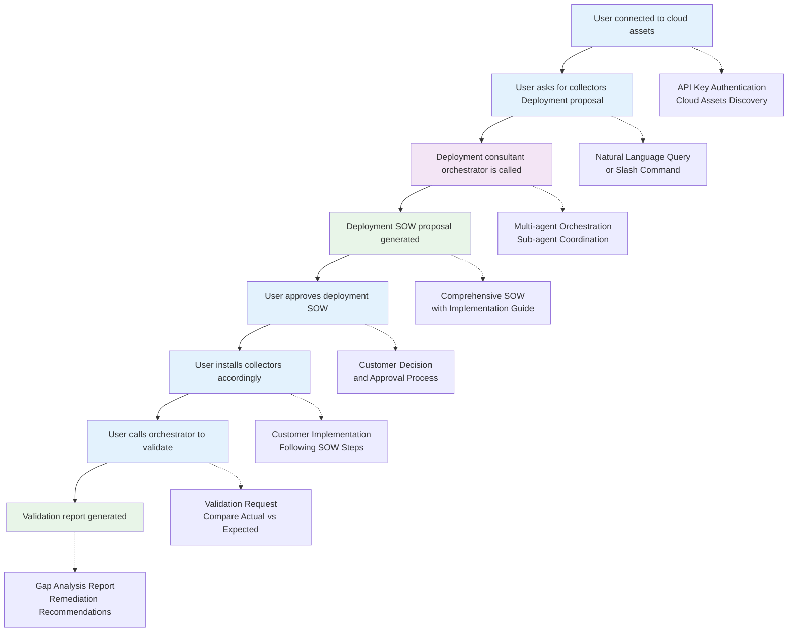

# Main Deployment Flow

## Overview
This flowchart represents the high-level user journey through the Salt Security deployment advisor system, from initial connection to final validation.

## User Journey Flow

## Flow Stages

### 1. **Initial Connection (A)**
- User authenticates with API key
- System discovers cloud assets and architecture
- Establishes baseline for deployment planning

### 2. **Deployment Request (B)**
- User submits deployment query via natural language or slash command
- System captures requirements and deployment context
- Triggers orchestrator activation

### 3. **Orchestration Phase (C)**
- Orchestrator coordinates deployment-advisor, data-extractor, and other sub-agents
- Comprehensive architecture analysis and recommendation generation
- Multi-source data collection and validation

### 4. **SOW Generation (D)**
- Reporter agent creates detailed Statement of Work
- Includes implementation steps, resource requirements, and risk assessment
- Provides multiple deployment options with trade-off analysis

### 5. **Customer Approval (E)**
- Customer reviews and approves deployment approach
- May iterate on requirements or deployment options
- Finalizes implementation plan

### 6. **Implementation Phase (F)**
- Customer follows SOW implementation steps
- Deploys collectors and configures monitoring
- Sets up traffic collection infrastructure

### 7. **Validation Request (G)**
- Customer requests deployment validation
- Orchestrator coordinates validator agent and data-extractor
- Compares actual deployment against SOW specifications

### 8. **Validation Report (H)**
- Reporter generates comprehensive validation report
- Includes gap analysis and remediation recommendations
- Provides compliance assessment and next steps

## Integration Points

- **API Authentication**: Secure access to customer cloud assets
- **Multi-agent Coordination**: Orchestrated sub-agent collaboration
- **Session Management**: Conversation context and history tracking
- **Document Generation**: Professional SOW and validation reports
- **Learning System**: Anonymized pattern extraction for system improvement

## Success Metrics

- **Deployment Success Rate**: Percentage of successful implementations
- **User Satisfaction**: Quality of recommendations and documentation
- **Time to Deployment**: Efficiency of the advisory process
- **Validation Accuracy**: Precision of gap analysis and remediation guidance

## Usage Notes

This main flow provides the overall context for the deployment advisor system. Sub-agents should understand their role within this broader user journey and contribute to the seamless experience from initial query to successful deployment validation.