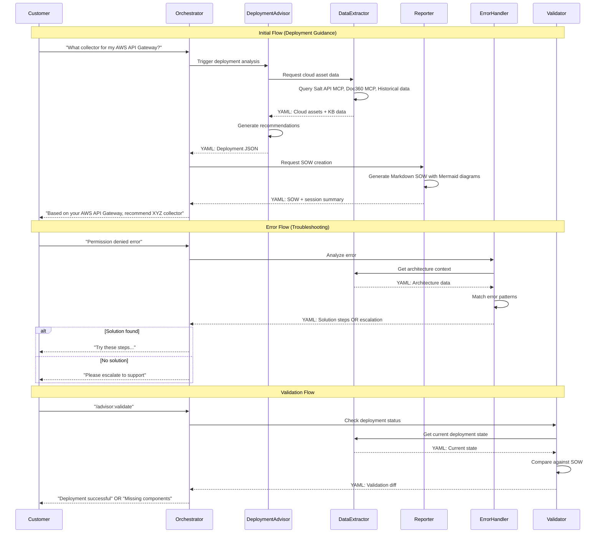

# Deployment Advisor Orchestrator - Product Requirements Document

## Introduction/Overview
The Deployment Advisor Orchestrator is the central controller for Salt Security's
AI-powered traffic collection deployment assistance system. This orchestrator
manages interactions between DevOps Engineers and specialized sub-agents to
provide deployment recommendations, troubleshooting guidance, and validation
services through Claude Code CLI integration. The system aims to reduce
deployment complexity, minimize support tickets, and accelerate successful
collector implementations.

## Objectives & Success Metrics

**Business Objectives:**
- **Simplify Deployment**: Customers can ask natural language questions about
  collector deployment
- **Improve Support Experience**: Reduce the need for manual documentation
  checks, support tickets, or solution architect intervention
- **Contextual Intelligence**: Tailor answers using customer-specific
  architectures
- **Continuous Learning**: Learn from past customer interactions while ensuring
  privacy
- **Error Handling**: Detect, suggest fixes, and guide customers through
  troubleshooting

**Success Metrics:**
- **System Functionality**: Orchestrator successfully coordinates sub-agents and
  returns deployment recommendations for user queries
- **User Adoption**: DevOps Engineers successfully complete deployment guidance
  sessions using the orchestrator
- **Response Completeness**: System provides actionable deployment
  recommendations with specific next steps
- **Error Handling**: System gracefully handles sub-agent failures and provides
  meaningful feedback to users
- **Session Completion**: Users complete their deployment guidance workflows
  without system errors or crashes

## User Personas & Use Cases

### User Personas
**Primary: DevOps Engineer**: Technical professional responsible for collector
deployment
- **Characteristics**: Cloud platform expertise (AWS/Azure/GCP), infrastructure
  automation experience, security-conscious
- **Needs**: Clear deployment guidance, troubleshooting support, validation
  tools, architectural recommendations
- **Goals**: Deploy collectors efficiently, ensure comprehensive traffic
  coverage, minimize deployment risks

**Secondary: Solution Architect**: Senior technical advisor for complex
deployments
- **Characteristics**: Multi-cloud expertise, enterprise architecture knowledge,
  customer-facing role
- **Needs**: Deployment strategy validation, best practices guidance,
  scalability recommendations
- **Goals**: Design optimal collector architectures, ensure customer success,
  reduce implementation complexity

### User Stories
- As a DevOps Engineer, I want to ask "What collector should I use for my AWS
  API Gateway?" so that I get specific recommendations for my architecture
- As a DevOps Engineer, I want to troubleshoot "Permission denied errors during
  collector setup" so that I can resolve deployment blockers quickly
- As a DevOps Engineer, I want to validate "Is my collector deployment
  complete?" so that I can confirm successful implementation
- As a Solution Architect, I want to generate deployment SOW documents so that
  I can provide detailed implementation plans to customers

### Use Cases
1. **Initial Deployment Guidance**: Engineer asks architecture-specific
   questions and receives tailored collector recommendations with prerequisites
2. **Error Troubleshooting**: Engineer reports deployment errors and receives
   step-by-step resolution guidance based on their specific architecture
3. **Deployment Validation**: Engineer requests verification that their
   collector setup is complete and functioning correctly
4. **Command-Driven Workflows**: Engineer uses structured commands for
   streamlined deployment processes

## Feature Scope

### In Scope
- Natural language conversation handling via Claude Code CLI
- Sub-agent coordination and workflow management (Deployment Advisor, Data
  Extractor, Error Handler, Validator, Reporter)
- Command-based interaction with `/advisor:` prefix (case-insensitive)
- Session continuity and context preservation
- Multi-turn conversation support with clarifying questions
- Integration with all MCP services (Salt API, Document360, Context7, Web Search)
- Error handling and graceful degradation with support escalation
- Customer satisfaction detection and response adjustment
- Anonymous session history storage and learning system
- Deployment SOW generation with Mermaid diagrams
- Flowcharts directory for deployment decision trees

### Out of Scope
- Direct UI/web interface (Claude Code CLI only)
- Multi-language support (English only)
- Integration with support ticketing systems (escalation suggestions only)
- Real-time deployment monitoring
- Automated collector installation (guidance only)
- Parallel sub-agent execution (sequential processing only)

### Future Considerations
- Web dashboard integration
- Multi-language conversation support
- Advanced analytics and reporting
- Integration with Salt Security console

## Deliverables

**Product Type**: Claude Code Agent System (not traditional program code)
- **Primary Deliverable**: Set of Claude Code agents with standardized markdown
  specifications
- **Agent Structure**: Each sub-agent defined with name, description, tools, and
  interaction flows
- **Command Integration**: `/advisor:` prefixed commands integrated into Claude
  Code CLI
- **Session Storage**: Git-based session history with customer-specific and
  anonymized versions
- **Documentation**: Complete agent specifications and interaction patterns
- **Transferability**: Entire agent system transferable to other Claude Code
  installations

## Agent Interaction Architecture

### Orchestrator Flow Diagram


### Sub-Agent Communication Protocol
```mermaid
classDef orchestrator fill:#e1f5fe,stroke:#0277bd,stroke-width:3px,color:#000
classDef subagent fill:#f3e5f5,stroke:#7b1fa2,stroke-width:2px,color:#000
classDef dataonly fill:#e8f5e8,stroke:#388e3c,stroke-width:2px,color:#000

graph TD
    O[Orchestrator]:::orchestrator

    DA[Deployment Advisor]:::subagent
    DE[Data Extractor]:::dataonly
    EH[Error Handler]:::subagent
    V[Validator]:::subagent
    R[Reporter]:::subagent

    O -.-> DA
    O -.-> EH
    O -.-> V
    O -.-> R

    DA --> DE
    EH --> DE
    V --> DE

    DE --> Salt[Salt API MCP]
    DE --> Doc360[Document360 MCP]
    DE --> Hist[Historical Sessions]
    DE --> Web[Web Search MCP]

    R --> Sessions[Customer Sessions]
    R --> General[General Sessions]

    subgraph "YAML Communication"
        YA["status: success/partial/fail<br/>data: {...}<br/>errors: [...]<br/>retry_count: 0-3"]
    end

    subgraph "Data Sources (Priority Order)"
        P1["1. Historical Data"]
        P2["2. KB/Documentation"]
        P3["3. Web Search"]
        P4["4. Customer Q&A"]
    end

    subgraph "MCP Access Rules"
        Rule1["Only Data Extractor<br/>can use Document360 MCP"]
    end
```

## Functional Requirements

### Cucumber/Gherkin Scenarios
```gherkin
Feature: Deployment Advisor Orchestrator

Scenario: Initial deployment guidance request
  Given a DevOps Engineer is connected via Claude Code CLI
  When they ask "What collector should I use for my AWS API Gateway setup?"
  Then the orchestrator should trigger the Deployment Advisor sub-agent
  And coordinate with Data Extractor to gather cloud asset information
  And return specific collector recommendations with prerequisites
  And provide implementation guidance

Scenario: Error troubleshooting workflow
  Given a DevOps Engineer encounters a deployment error
  When they report "I'm getting permission denied errors"
  Then the orchestrator should trigger the Error & Solution Handler
  And analyze the error against their architecture
  And provide step-by-step resolution guidance
  And offer to validate the fix when applied

Scenario: Command-based deployment validation
  Given a DevOps Engineer has completed collector setup
  When they run "/advisor:validate"
  Then the orchestrator should trigger the Validator sub-agent
  And compare deployment status against SOW requirements
  And return validation results with any missing components
  And confirm successful deployment or suggest corrections

Scenario: Multi-turn conversation continuity
  Given an ongoing deployment guidance session
  When the DevOps Engineer asks follow-up questions
  Then the orchestrator should maintain previous context
  And provide relevant answers based on conversation history
  And ask clarifying questions when needed for better guidance

Scenario: Sub-agent coordination with retry logic
  Given the orchestrator calls a sub-agent
  When the sub-agent returns a "partial fail" status
  Then the orchestrator should retry the operation up to 3 times
  And escalate to alternative approaches if retries fail
  And maintain transparent communication with the user
```

### Detailed Requirements

1. **Conversation Management**: The orchestrator must maintain conversation
   state across multiple interactions and preserve context for follow-up
   questions

2. **Request Routing**: The system must analyze user queries and route them to
   appropriate sub-agents based on intent (deployment, troubleshooting,
   validation)

3. **Sub-Agent Coordination**: The orchestrator must coordinate between
   multiple sub-agents sequentially, handle their YAML responses, and synthesize
   coherent answers

4. **Command Processing**: The system must support case-insensitive structured
   commands with `/advisor:` prefix for common workflows (advise, troubleshoot,
   validate, report)

5. **Natural Language Processing**: The orchestrator must understand deployment-
   related queries and extract key information (cloud provider, services, error
   messages)

6. **Error Handling**: The system must gracefully handle sub-agent failures,
   external service outages, and provide meaningful feedback to users

7. **Session Management**: The orchestrator must track session progress,
   customer satisfaction indicators, and store sessions under
   `/sessions/[customer_company_id]/[session_version]/` with version
   incrementation

8. **Data Source Priority**: The orchestrator must prioritize data sources in
   order: (1) Historical data, (2) KB/Documentation via MCP, (3) Web search,
   (4) Customer Q&A sessions

9. **Sub-Agent Failure Handling**: When sub-agents fail after 3 retry attempts,
   the orchestrator must suggest escalating to support as defined in original
   PRD flows

10. **Document360 MCP Access**: Only the Data Extractor sub-agent is allowed to
    use the Document360 MCP integration

11. **Session Anonymization**: The Reporter must create scrubbed versions stored
    in `/general_sessions/[md5_hash_of_company_id]/` with customer IDs removed
    and resource names replaced with UUIDs

12. **Flowcharts Integration**: The system must maintain a dedicated flowcharts
    directory for deployment decision trees that the Deployment Advisor consults

## Non-Functional Requirements

### Performance
- **Sequential Processing**: Sub-agents execute sequentially (not in parallel)
  due to Claude Code architecture limitations
- **Response Strategy**: Prioritize response accuracy over speed
- **Session Continuity**: Maintain conversation context across multiple
  interactions

### Security
- **Authentication**: Leverage Claude Code CLI session authentication
- **Data Privacy**: No customer-specific identifiers stored permanently
- **Session Isolation**: Complete isolation between different customer sessions
- **MCP Security**: Secure credential management for all external service
  integrations

### Usability
- **Natural Language**: Support conversational English for deployment topics
- **Command Consistency**: Standardized `/advisor:` command structure across
  all workflows
- **Error Messages**: Clear, actionable error messages without technical jargon
- **Progress Indicators**: Clear communication during multi-step processes

### Reliability
- **Error Recovery**: Graceful degradation when sub-agents or external services
  fail
- **Retry Logic**: Maximum 3 retry attempts per sub-agent call with exponential
  backoff
- **Support Escalation**: Clear escalation to support when sub-agents fail after
  retries
- **Fallback Strategies**: Alternative approaches when primary workflows fail

### Architecture
- **Design Pattern**: System must follow **Clean Architecture** principles
- **Layer Separation**: Clear separation between orchestration logic, sub-agent
  coordination, and external integrations
- **Dependency Inversion**: Dependencies flow inward toward orchestration core
- **Testability**: Mockable interfaces for all sub-agent and external service
  interactions

## Dependencies & Risks

### Dependencies
- **Internal Dependencies**:
  - Deployment Advisor sub-agent (generates deployment JSON for Reporter)
  - Data Extractor sub-agent (exclusive Document360 MCP access, historical
    session analysis)
  - Error & Solution Handler sub-agent (error pattern matching and solutions)
  - Validator sub-agent (deployment status comparison against SOW)
  - Reporter sub-agent (SOW generation with Mermaid diagrams, session storage)
- **External Dependencies**:
  - Salt API MCP Server (implemented)
  - Document360 MCP Server (planned) - Data Extractor only
  - Context7 MCP Server integration
  - Web Search MCP integration
  - Claude Code CLI framework with Task tool support
  - Git repository for session storage

### Risks
- **Sub-Agent Development Complexity**: Multiple specialized agents need
  coordinated development - *Mitigation*: Phased implementation starting with
  core agents
- **MCP Integration Dependencies**: External MCP services may not be ready -
  *Mitigation*: Implement graceful degradation and mock services for testing
- **Natural Language Understanding**: Complex deployment queries may be
  misunderstood - *Mitigation*: Implement clarifying question workflows and
  fallback to structured commands
- **Multi-Agent Coordination**: Complex workflows may have race conditions or
  deadlocks - *Mitigation*: Implement timeout handling and circuit breakers
- **Customer Context Preservation**: Long conversations may lose important
  context - *Mitigation*: Implement structured session state management

## Resolved Requirements

### Data Source Conflict Resolution
When conflicting recommendations occur between data sources, the system must:
1. **Historical Data (Priority 1)** takes precedence over all other sources
2. **KB Documentation (Priority 2)** overrides web search and customer Q&A
3. **Web Search (Priority 3)** overrides customer Q&A only
4. **Customer Q&A (Priority 4)** is used when no other sources provide guidance
5. **Credibility Scoring**: For historical data, calculate credibility (1-10) based
   on recency and architecture similarity to current deployment

### YAML Inter-Agent Communication Schema
All sub-agents must use this standardized YAML format:
```yaml
status: "success" | "partial" | "fail"
data:
  # Agent-specific response data
retry_count: 0-3
errors:
  - "Error message 1"
  - "Error message 2"
knowledge_gaps:
  - "Missing information 1"
external_diffs:
  - source: "kb" | "web" | "aws_docs"
    conflict_description: "Description of conflict"
    recommended_resolution: "How to resolve"
```

### Support Escalation Criteria
Automatic escalation to support occurs when:
1. Sub-agent fails after 3 retry attempts
2. No solution found in Error Handler's known patterns
3. Critical deployment errors with no documented resolution
4. Customer explicitly requests human support
5. Orchestrator detects repeated failure patterns in same session

### Customer Satisfaction Detection
The orchestrator will detect satisfaction through:
1. **Positive Indicators**: "Thank you", "That worked", "Perfect", completion of
   suggested actions
2. **Negative Indicators**: "That didn't work", "I'm still having issues", repeated
   similar questions
3. **Completion Signals**: Successful validation, implementation of SOW recommendations
4. **Escalation Requests**: Direct requests for human help or support tickets

## Remaining Open Questions
- How do we balance conversation naturalness with structured data collection needs?
- Should the flowcharts directory be version-controlled separately or included in
  the main repository?