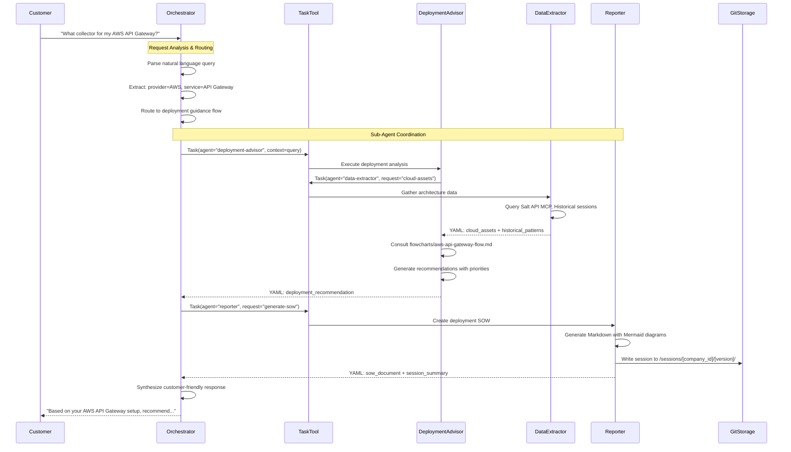
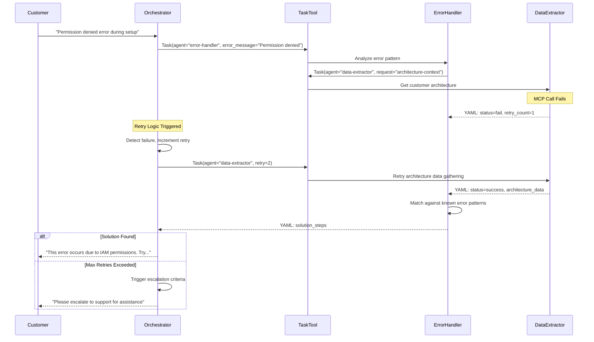
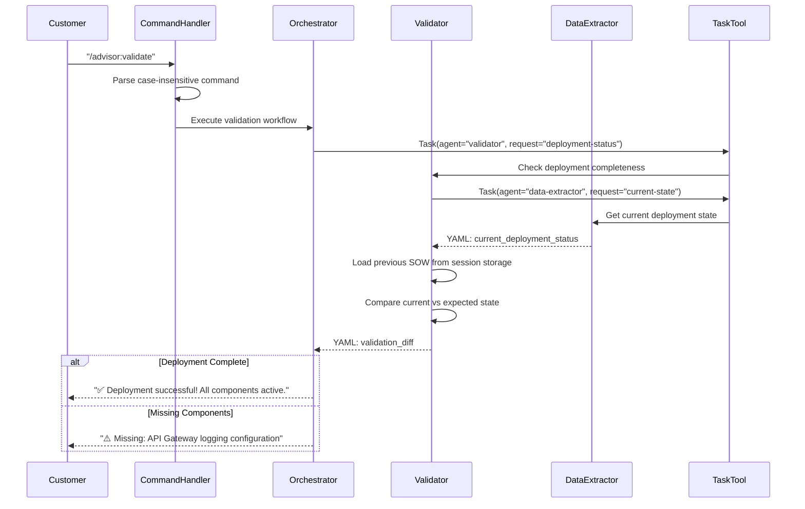

# Deployment Advisor Orchestrator - Technical Design Document

## Reference Documents
- **Product Requirements Document**: [2025-09-14-SALT-999-deployment-advisor-orchestrator-prd.md](2025-09-14-SALT-999-deployment-advisor-orchestrator-prd.md)
- **System Architecture**: [../ai-docs/ARCHITECTURE.md](../ai-docs/ARCHITECTURE.md)

## High-Level Architecture

### System Overview
The Deployment Advisor Orchestrator follows **Clean Architecture** principles as
a Claude Code Agent System. The orchestrator serves as the domain core,
coordinating sub-agents through the Task tool while maintaining conversation
context via Claude Code's built-in session management. The system is designed
as a portable agent package that can be transferred between Claude Code
installations.

### Architecture Diagram - Clean Architecture
```mermaid
classDef domainCore fill:#d4edda,stroke:#155724,stroke-width:3px,color:#000
classDef applicationLayer fill:#d1ecf1,stroke:#0c5460,stroke-width:2px,color:#000
classDef infrastructureLayer fill:#fff3cd,stroke:#856404,stroke-width:2px,color:#000
classDef external fill:#f8d7da,stroke:#721c24,stroke-width:2px,color:#000

graph TD
    subgraph "Infrastructure Layer"
        CLI[Claude Code CLI]:::infrastructureLayer
        Git[Git Session Storage]:::infrastructureLayer
        MCP[MCP Clients Pool]:::infrastructureLayer
    end

    subgraph "Application Layer"
        Commands["/advisor: Commands"]:::applicationLayer
        TaskTool[Task Tool Invocation]:::applicationLayer
        YAMLHandler[YAML Communication Handler]:::applicationLayer
        SessionManager[Session State Manager]:::applicationLayer
    end

    subgraph "Domain Core - Orchestrator"
        RequestRouter[Request Router]:::domainCore
        ConversationManager[Conversation Manager]:::domainCore
        RetryLogic[Retry & Escalation Logic]:::domainCore
        SatisfactionDetector[Customer Satisfaction Detector]:::domainCore
    end

    subgraph "Sub-Agents (External)"
        DA[Deployment Advisor]:::external
        DE[Data Extractor]:::external
        EH[Error Handler]:::external
        V[Validator]:::external
        R[Reporter]:::external
    end

    CLI --> Commands
    Commands --> RequestRouter
    TaskTool --> RequestRouter

    RequestRouter --> ConversationManager
    ConversationManager --> RetryLogic
    RetryLogic --> SatisfactionDetector

    RequestRouter --> TaskTool
    TaskTool -.-> DA
    TaskTool -.-> DE
    TaskTool -.-> EH
    TaskTool -.-> V
    TaskTool -.-> R

    SessionManager --> Git
    YAMLHandler --> MCP

    subgraph "Data Flow Direction"
        direction TB
        Infrastructure[Infrastructure Layer] --> Application[Application Layer]
        Application --> Domain[Domain Core]
        Domain --> SubAgents[Sub-Agents]
    end
```

### Integration Points
- **Claude Code CLI**: Primary interface for customer interactions and command
  processing
- **Task Tool**: Sub-agent invocation mechanism with direct agent targeting
- **MCP Services**: External data sources (Salt API, Document360, Context7,
  Web Search)
- **Git Repository**: Session storage with customer-specific and anonymized
  versions
- **File System**: Flowcharts directory and agent specification files

## Detailed Design

### Orchestrator Implementation Structure
```
agents/
├── orchestrator.md                 # Main orchestrator agent specification
├── deployment-advisor.md           # Deployment SME agent
├── data-extractor.md              # MCP integration & historical analysis
├── error-handler.md               # Troubleshooting agent
├── validator.md                   # Deployment verification agent
├── reporter.md                    # SOW generation & session storage
├── flowcharts/                    # Deployment decision trees
│   ├── aws-api-gateway-flow.md
│   ├── azure-apim-flow.md
│   └── deployment-validation-flow.md
└── commands/                      # Command definitions
    ├── advisor-advise.md
    ├── advisor-troubleshoot.md
    ├── advisor-validate.md
    └── advisor-report.md
```

### Sequence Diagrams

#### Initial Deployment Flow


#### Error Handling Flow with Retry Logic


#### Command-Based Validation Flow


### System Components

#### Orchestrator (Domain Core)
**Responsibilities:**
- Natural language query parsing and intent recognition
- Request routing to appropriate sub-agents based on context
- Sub-agent coordination through Task tool with retry logic
- Customer conversation management and context preservation
- Response synthesis from multiple sub-agent outputs
- Customer satisfaction detection and escalation triggers

**Key Interfaces:**
```yaml
# Input: Customer query or command
customer_input:
  type: "natural_language" | "command"
  content: string
  context: conversation_history

# Output: Synthesized response
orchestrator_response:
  content: string
  actions_taken: [sub_agent_calls]
  session_updated: boolean
  escalation_required: boolean
```

#### Task Tool Integration Layer
**Responsibilities:**
- Direct sub-agent invocation with specified agent names
- YAML data marshalling/unmarshalling between agents
- Failure detection through multiple mechanisms:
  - YAML status parsing (`status: fail/partial/success`)
  - Exception handling from Task tool calls
  - Timeout detection for long-running operations
- Retry orchestration with exponential backoff

**Agent Invocation Pattern:**
```python
# Pseudo-code for Task tool usage
try:
    result = Task(
        description="Analyze deployment for AWS API Gateway",
        prompt=f"Customer query: {query}\nContext: {context}",
        subagent_type="deployment-advisor"
    )
    parsed_result = parse_yaml_response(result)
    if parsed_result.status == "fail":
        handle_retry_logic(parsed_result)
except TimeoutException:
    trigger_escalation("Sub-agent timeout")
except Exception as e:
    log_failure_and_escalate(e)
```

#### YAML Communication Handler
**Responsibilities:**
- Standardized YAML schema enforcement across all sub-agents
- Data serialization/deserialization with validation
- Error aggregation and conflict resolution based on data source priority
- Knowledge gap identification and reporting

**Standard YAML Schema:**
```yaml
# Sub-agent response format
status: "success" | "partial" | "fail"
data:
  # Agent-specific response data structure
  recommendations: []
  architecture_analysis: {}
  deployment_steps: []
retry_count: 0-3
errors:
  - "Specific error message 1"
  - "Connection timeout to MCP service"
knowledge_gaps:
  - "Missing AWS region information"
  - "Historical data not available for this architecture"
external_diffs:
  - source: "kb" | "web" | "aws_docs"
    conflict_description: "Documentation version mismatch"
    recommended_resolution: "Use KB version as authoritative"
credibility_score: 1-10  # For historical data sources
```

#### Session Manager
**Responsibilities:**
- Customer session identification and isolation
- Conversation context preservation using Claude Code's built-in mechanisms
- Real-time session storage to `/sessions/[customer_company_id]/[session_version]/`
- Session versioning with incremental numbering
- Automatic anonymization for general learning storage

**Session Storage Structure:**
```
sessions/
├── customer-123/
│   ├── session-001/
│   │   ├── conversation.md
│   │   ├── deployment-sow.md
│   │   ├── cloud-assets-snapshot.yaml
│   │   ├── sub-agent-reports.yaml
│   │   └── session-metadata.yaml
│   └── session-002/
│       └── [similar structure]
└── general_sessions/
    └── a1b2c3d4e5f6.../  # MD5 hash of company_id
        ├── anonymized-conversation.md
        ├── generalized-sow.md
        └── learning-patterns.yaml
```

#### MCP Client Pool Manager
**Responsibilities:**
- Centralized MCP connection management for all sub-agents
- Connection pooling and reuse for performance optimization
- Authentication credential management for external services
- Service health monitoring and circuit breaker implementation
- Data Extractor exclusive access enforcement for Document360 MCP

**MCP Service Routing:**
```yaml
mcp_services:
  salt_api:
    access: "all_agents_via_data_extractor"
    status: "implemented"
    health_check_interval: 30s

  document360:
    access: "data_extractor_only"
    status: "planned"
    exclusive_agent: "data-extractor"

  context7:
    access: "all_agents_via_data_extractor"
    status: "planned"

  web_search:
    access: "all_agents_via_data_extractor"
    status: "planned"
```

### State Management

**Conversation Context:**
- **Claude Code Session**: Primary context preservation mechanism
- **Conversation History**: Maintained automatically by Claude Code framework
- **Customer Satisfaction Tracking**: Real-time indicators based on response
  patterns
- **Intent Tracking**: Current workflow state (deployment/troubleshooting/
  validation)

**Data Persistence:**
- **Session Files**: Direct writes during conversation for immediate storage
- **Anonymized Learning**: Batch processing for general session creation
- **Flowcharts**: Version-controlled markdown files in dedicated directory
- **Agent Specifications**: Portable .md files for customer distribution

**Consistency Guarantees:**
- **Eventually Consistent**: Session storage may have slight delays
- **Conversation Continuity**: Guaranteed through Claude Code's session
  management
- **Data Source Priority**: Strict ordering enforced (Historical → KB → Web →
  Customer)

## API Design

### Command Interface

#### /advisor:advise
- **Type:** Case-insensitive command
- **Description:** Trigger deployment guidance workflow
- **Usage:** `/advisor:advise` or natural language equivalent
- **Processing:** Routes to deployment-advisor agent via Task tool
- **Response:** Deployment recommendations with SOW generation

#### /advisor:troubleshoot
- **Type:** Case-insensitive command
- **Description:** Error analysis and resolution guidance
- **Usage:** `/advisor:troubleshoot [error description]`
- **Processing:** Routes to error-handler agent with context
- **Response:** Step-by-step resolution or escalation recommendation

#### /advisor:validate
- **Type:** Case-insensitive command
- **Description:** Deployment status verification
- **Usage:** `/advisor:validate`
- **Processing:** Routes to validator agent for SOW comparison
- **Response:** Validation results with missing components identified

#### /advisor:report
- **Type:** Case-insensitive command
- **Description:** Generate deployment SOW document
- **Usage:** `/advisor:report`
- **Processing:** Routes to reporter agent for document generation
- **Response:** Formatted Markdown SOW with Mermaid diagrams

### Agent Communication API

#### Task Tool Invocation Pattern
```yaml
# Standard agent invocation
task_request:
  description: "Human-readable task description"
  prompt: "Detailed context and requirements"
  subagent_type: "deployment-advisor" | "data-extractor" | "error-handler" |
                 "validator" | "reporter"

# Response handling
task_response:
  success: boolean
  content: yaml_formatted_response
  error_details: string_if_failed
```

#### Data Exchange Protocols
- **Request Format**: Contextual prompts with YAML-embedded data
- **Response Format**: Standardized YAML schema with status indicators
- **Error Propagation**: Structured error messages with retry recommendations
- **Timeout Handling**: 120-second default with graceful degradation

### Authentication & Authorization
- **Authentication:** Inherits Claude Code CLI session authentication
- **Customer Isolation:** Automatic session boundary enforcement
- **MCP Credentials:** Environment variable-based secure credential storage
- **Agent Access Control:** Document360 MCP restricted to data-extractor only

### Error Handling
- **YAML Status Codes:** success/partial/fail with detailed error arrays
- **Retry Logic:** Maximum 3 attempts with exponential backoff (2^n seconds)
- **Escalation Triggers:** Multiple failure detection mechanisms
- **Graceful Degradation:** Fallback to available data sources when MCP services fail

## Data Considerations

### Session Storage Schema
```yaml
# Session Metadata
session_metadata:
  customer_company_id: string
  session_version: integer
  created_at: timestamp
  last_updated: timestamp
  workflow_type: "deployment" | "troubleshooting" | "validation"
  completion_status: "in_progress" | "completed" | "escalated"

# Conversation Tracking
conversation:
  messages: []
  customer_satisfaction_indicators:
    positive_signals: []
    negative_signals: []
    escalation_requests: []
  context_preservation:
    cloud_provider: string
    services_discussed: []
    current_deployment_state: {}

# Sub-Agent Reports
sub_agent_reports:
  deployment_advisor:
    recommendations: []
    flowcharts_consulted: []
    confidence_score: 1-10
  data_extractor:
    sources_queried: ["salt_api", "historical", "kb"]
    data_conflicts: []
    credibility_scores: {}
```

### Data Relationships
- **Customer Sessions** → **Anonymized Learning Sessions**: One-to-many with UUID
  replacement
- **Deployment SOW** → **Validation Reports**: Referenced for completion checking
- **Historical Sessions** → **Current Recommendations**: Credibility-weighted
  influence
- **Flowcharts** → **Deployment Advice**: Structured decision tree consultation

### Data Validation
- **YAML Schema Validation**: Runtime enforcement of sub-agent response format
- **Customer ID Sanitization**: Automatic removal for anonymized sessions
- **Resource Name UUIDs**: Consistent replacement pattern for generalization
- **Session Versioning**: Monotonic increment with conflict prevention

## Performance, Scalability, and Reliability

### Performance Optimization
- **Sequential Processing**: Optimized for accuracy over speed due to Claude Code
  architecture
- **MCP Connection Pooling**: Reuse connections across sub-agent calls
- **Intelligent Caching**: Historical session data cached for quick pattern
  matching
- **Flowchart Pre-loading**: Decision trees loaded into memory for fast consultation

### Scalability Considerations
- **Stateless Agent Design**: Each sub-agent call is independent and stateless
- **Session Isolation**: Complete customer session boundaries prevent
  cross-contamination
- **Horizontal Agent Distribution**: Portable agent package supports multiple
  Claude Code installations
- **Data Source Load Balancing**: MCP service health monitoring with failover

### Reliability Patterns
- **Circuit Breakers**: MCP service failure detection with automatic fallback
- **Retry Logic**: Exponential backoff with maximum 3 attempts per sub-agent
- **Timeout Handling**: 120-second Task tool timeout with graceful recovery
- **Health Monitoring**: Continuous MCP service availability checking

### Monitoring & Observability
- **Session Metrics**: Completion rates, escalation frequency, satisfaction
  indicators
- **Sub-Agent Performance**: Success rates, retry patterns, failure modes
- **MCP Service Health**: Connection status, response times, error rates
- **Customer Journey Tracking**: Workflow progression and bottleneck identification

## Open Questions
- **Flowcharts Storage**: Should decision trees be version-controlled in main
  repository or separate flowcharts repository for easier updates?
- **Agent Package Versioning**: How should we version the complete agent package
  for customer distribution and compatibility tracking?
- **Session Storage Cleanup**: What retention policy should be applied to
  customer sessions and anonymized learning data?
- **Performance Monitoring**: Should we implement custom metrics collection for
  agent performance, or rely on Claude Code's built-in monitoring?